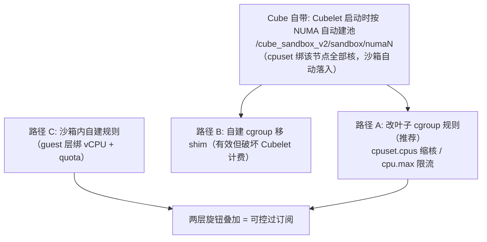

# Cube 沙箱 cgroup 绑核笔记

> 场景：PV qspinlock 性能测试需要规范化沙箱运行范围（绑核 + 限流制造可控过订阅）。
> 前提：宿主 cgroup v2；沙箱内 guest-init 已挂 cgroup2（`agent.unified_cgroup_hierarchy=true`）。

## 0. 机制总览



- 三条路径都可写 cpuset / cpu.max，差异在**是否脱离 Cubelet 的 cgroup 管理树**。
- 一条规则：**改 Cube 已有 cgroup 优于自建 cgroup**——效果一样且不破坏计费/清理闭环。

## 1. Cube 自带 NUMA 池（不用配，验证即可）

Cubelet 启动时读 `/sys/devices/system/node/node*/cpulist`，每个 NUMA 节点建池并绑核；沙箱创建时被调度到某 NUMA 池 → shim 进程（含 vCPU 线程）自动绑到该节点核集。

```bash
# 验证池已建且绑核
ls /sys/fs/cgroup/cube_sandbox_v2/sandbox/          # numa0/ numa1/
cat /sys/fs/cgroup/cube_sandbox_v2/sandbox/numa0/cpuset.cpus.effective

# 验证沙箱确实被绑
pgrep -f CubeShim
grep Cpus_allowed_list /proc/<pid>/status           # = 某 numaN 池核列表
```

限制：粒度是 **NUMA 节点**（不是任意核集合）；单 NUMA 机器等于没绑。NUMA 选择由调度链路透传（注解 `cube.master.instance.numa_node`），无文档化手动入口。

## 2. 路径 A：改 Cubelet 叶子 cgroup 规则（测试首选）

不动进程归属，直接改叶子 cgroup：

```bash
# 1. 定位沙箱叶子 cgroup
cat /proc/<shim_pid>/cgroup        # 0::/cube_sandbox_v2/sandbox/numa0/<id>

# 2. 改规则（cpuset 必须是所属 numa 池核集的子集；cpu.max 单位 µs/周期）
echo "0-3" > /sys/fs/cgroup/cube_sandbox_v2/sandbox/numa0/<id>/cpuset.cpus
echo "500000 1000000" > .../<id>/cpu.max      # 整沙箱限流 50%

# 3. 验证（立即生效）
grep Cpus_allowed_list /proc/<shim_pid>/status
```

- ✅ 计费/限额/清理不受影响
- ⚠️ 沙箱重建后叶子 cgroup 重建，规则需重写（脚本化）

## 3. 路径 B：宿主自建 cgroup（临时实验机可用）

```bash
echo "+cpuset +cpu" > /sys/fs/cgroup/cgroup.subtree_control
mkdir /sys/fs/cgroup/pvtest
echo "0-3" > /sys/fs/cgroup/pvtest/cpuset.cpus
echo <shim_pid> > /sys/fs/cgroup/pvtest/cgroup.procs
```

代价：shim 离开 Cubelet 池 → **CPU/内存配额失效、用量上报失真、销毁清理不管它**。生产禁用。

## 4. 路径 C：沙箱内自建规则（guest 层）

沙箱内 cgroup2 为 rw，root 可自建：

```bash
mkdir /sys/fs/cgroup/bench
echo "0-1" > /sys/fs/cgroup/bench/cpuset.cpus               # 绑 vCPU
echo "200000 1000000" > /sys/fs/cgroup/bench/cpu.max        # 20% CPU 配额
echo <hackbench_pid> > /sys/fs/cgroup/bench/cgroup.procs
```

与宿主层叠加：宿主限 vCPU 线程（制造宿主级 holder preemption），沙箱内限负载（制造 guest 级抢占）。

## 5. 三条路径对比

| 路径 | 绑核 | 配额 | 对 Cube 计费/管理影响 | 适用 |
|---|---|---|---|---|
| Cube 自带 NUMA 池 | ✅（NUMA 级） | 自动 | 无（默认行为） | 部署隔离 / 同异 NUMA 对照 |
| A 改叶子 cgroup | ✅（任意子集） | ✅ | 无 | **测试首选** |
| B 自建 cgroup | ✅ | ✅ | ⚠️ 失效 | 临时实验机 |
| C 沙箱内 | ✅（vCPU 级） | ✅ | 无 | 与 A 叠加 |

## 6. PV 测试组合用法

- 宿主路径 A：一批沙箱 `cpuset.cpus` 压到同一小组核（如 8 沙箱×2 vCPU 绑 4 核 = 4:1 精确过订阅）；`cpu.max` 模拟配额场景。
- 沙箱内路径 C：hackbench 进程组绑 vCPU + 低 quota。
- A/B 对照用同一套规则值，交替跑。
- 绑核 ≠ 独占：核组内 vCPU 线程仍按 CFS 时间片互相抢占，holder preemption 照常发生，只是更可控。
- 备用手段：`taskset -pc 0-7 <shim_pid>`（整进程）/ `taskset -pc <n> <vcpu_tid>`（逐线程，CubeShim 未暴露 per-vCPU affinity，逐线程是细粒度唯一途径）。
