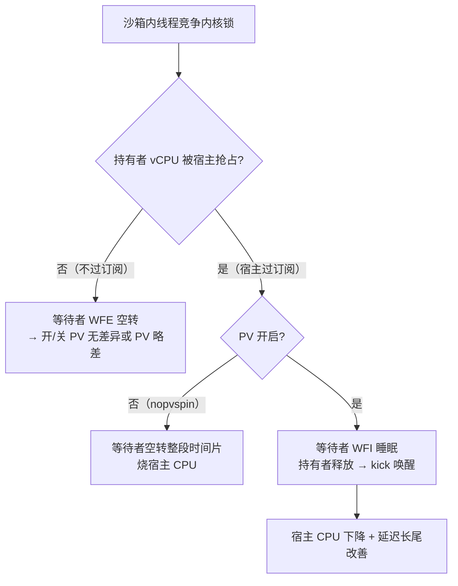

# Cube 沙箱 PV qspinlock 性能测试笔记

> 特性背景见 `pv-qspinlock-arm64-kvm.md`（arm64 WFI + VENDOR_KICK_CPU backend）。
> 测试对象：CubeSandbox 沙箱（microVM），宿主 arm64 + PV 补丁 + 位图默认开。

## 0. 生效前提（测不到差异 = 场景不对）

PV qspinlock 只在 **沙箱内多 vCPU 竞争内核锁 + 持有锁 vCPU 被宿主切出** 时生效：



⚠️ 纯用户态锁（pthread spinlock/mutex 不 syscall 的部分）**不经过内核 qspinlock，测不到**。

## 1. 功能验证

```bash
# guest
dmesg | grep -i "PV qspinlock"            # PV qspinlocks enabled
cat /sys/kernel/debug/lock_event_counts   # pv_wait_head/pv_kick_unlock 压测时增长

# host
echo 1 > /sys/kernel/debug/tracing/events/kvm/kvm_pvspin_kick_vcpu/enable
```

## 2. 环境准备

| 项 | 做法 |
|---|---|
| 宿主 | arm64 ≥16 核；PV 补丁 + 位图默认开 |
| 对照组 | 同一镜像，guest cmdline 加 `nopvspin`（自动退回 native/CNA） |
| 工具进沙箱 | 模板 rootfs 精简（busybox），静态编译 benchmark 打进模板镜像或 exec 上传 |
| 交替跑 | 开/关两组同宿主同时段交替各 ≥5 轮取中位数 |

## 3. Benchmark（走内核锁路径）

| 工具 | 场景 | 备注 |
|---|---|---|
| **hackbench** | pipe + 短任务调度风暴 | 内核锁密集，PV 经典项 |
| **will-it-scale** open1/pipe1/signal1 | syscall 风暴 | ⚠️ 不用 lock1/lock2（用户态锁） |
| **sysbench** threads/mutex | futex 竞争 | 走内核锁路径 |
| **schbench** / **cyclictest** | 调度延迟 / 长尾 | 看 p99/max |
| 真实负载 | 沙箱内 `make -j$(nproc)`、agent 多进程 | 最贴近实际 |

## 4. 场景矩阵

```
沙箱 vCPU：2 / 4 / 8（API cpu_count）
宿主过订阅：x1（预期无差异）→ x2 → x4
过订阅制造：批量沙箱 / Cubelet cgroup 限额 / 宿主 stress-ng 挤 vCPU 线程
```

## 5. 指标采集（四层）

| 层 | 指标 | 采集 |
|---|---|---|
| guest 吞吐 | hackbench 时间、will-it-scale ops/s、构建耗时 | 工具输出 |
| guest 延迟 | schbench p50/p99、cyclictest p99/max | 工具输出 |
| **宿主效率（核心）** | 等量负载下宿主 CPU 总占用 / vCPU 线程 CPU% | top / perf stat |
| PV 行为 | host `kvm_pvspin_kick_vcpu` 计数；guest lockevent `pv_wait_head`/`pv_kick_unlock`/`pv_spurious_wakeup`/`pv_hash_hops`；host debugfs `wfi_exit_stat` | trace-cmd / debugfs |

## 6. 判读

| 现象 | 含义 |
|---|---|
| 过订阅下宿主 CPU 下降、p99 改善、吞吐持平/升 | ✅ 特性生效 |
| 不过订阅下持平或略差 1-3% | 正常（WFI trap + kick 往返开销），默认开无伤害 |
| `pv_spurious_wakeup` 暴涨 | 唤醒空操作多（锁已变白踢） |
| kick ≫ wait、`pv_hash_hops` 大 | hash 碰撞，需调 hash 表大小 |

**一句话方法**：hackbench/will-it-scale 进沙箱 + 宿主过订阅 + `nopvspin` 交替对照 + 看宿主 CPU 与 p99。
