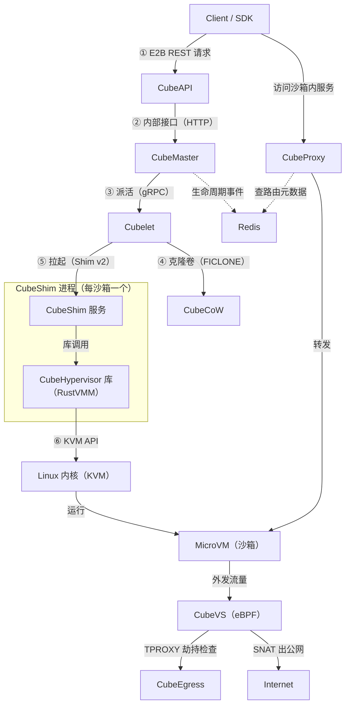

# CubeSandbox 架构讲解

> 一句话定位：腾讯云开源的、为 AI Agent 打造的微虚拟机沙箱服务——E2B SDK 兼容，<60ms 创建沙箱，硬件级隔离，<5MB 内存开销。

## 架构图



**图例**：实线 = 请求/调用流；虚线 = 状态读写（Redis 是公共白板）；①–⑥ = 创建沙箱的主流程。

这张图有两条主线：

- **控制面**（图的上半，①–⑥）：怎么把沙箱**建起来**
- **数据面**（图的下半）：怎么**用**沙箱——访问沙箱里的服务、沙箱访问外网

---

## 主流程：创建一个沙箱（按 ①–⑥）

每一步回答三个问题：**谁收到什么 → 做什么 → 发出什么**。

### ① Client/SDK → CubeAPI：E2B REST 请求

- 客户端（你的程序或 Agent 框架，通过 E2B SDK）发 `POST /sandboxes`
- 消息内容：模板 ID、环境变量、能否上网等（JSON）
- CubeAPI 是系统大门（Rust/Axum）：**认证、限流**，然后把请求翻译成内部格式转发

### ② CubeAPI → CubeMaster：内部接口（HTTP）

- 消息内容：同一个创建意图，内部格式
- CubeMaster 是调度中枢（Go），做三件事：**选节点**（查节点花名册，哪台机器资源够）→ **派活** → **发事件**
- 关键语义：到这里为止的请求是**集群级**的——只说"建一个沙箱"，不说在哪台机器

### ③ CubeMaster → Cubelet：派活（gRPC）

- 消息内容：节点级指令 `rpc Create`——目标已确定：在选中的那台机器上跑起来
- Cubelet 是节点上的执行者（每台计算节点一个），收到后跑**四段流水线**：

```
① 生成沙箱 ID、解析快照语义
② 并行准备：克隆卷（④）、准备网卡（TAP）、落元数据
③ cgroup 资源限额（限宿主侧进程）
④ 拉起 CubeShim（⑤）
```

### ④ Cubelet → CubeCoW：克隆卷（FICLONE）

- 消息内容："把模板的 rootfs 卷和内存快照卷各克隆一份"
- CubeCoW 用 XFS reflink 的 FICLONE：只复制**元数据**（块映射表 + 引用计数），物理数据零拷贝——O(1)，和卷大小无关
- 结果：沙箱拿到自己的可写 rootfs + 内存镜像文件；之后写多少才真正占多少磁盘

### ⑤ Cubelet → CubeShim：拉起（Shim v2，ttrpc）

- Cubelet **内嵌 containerd**（不是独立进程），containerd 通过 Shim v2 协议拉起 CubeShim——**每沙箱一个 CubeShim 进程**
- 消息内容：`Create` + `Start`——标准容器语义
- CubeShim 是**双向翻译器**：对 containerd 说容器话（让它以为在管普通容器），对虚拟机干真事

### ⑥ CubeShim → Linux KVM：KVM API

- 关键设计：CubeHypervisor（Cloud Hypervisor 的 Rust fork）以**库**的形式内嵌在 CubeShim 进程里，不是独立进程
- 消息内容：`VmCreate`（配置：vCPU 数、内存、rootfs 盘、TAP 网卡）→ `VmRestore`（内存快照路径）
- **<60ms 启动的秘密**：不是冷启动（BIOS → 内核 → init），而是把模板预先 boot 好的内存镜像 restore 进 KVM——"唤醒冬眠的人"
- VMM 通过 `/dev/kvm` 的 ioctl（KVM API）驱动内核：`KVM_RUN` 循环 + 处理 VM exit（设备模拟、缺页、中断注入）
- 结果：MicroVM 苏醒，vsock 就绪，沙箱可用

---

## 状态线：Redis（图的虚线）

- **谁写**：CubeMaster——沙箱生命周期事件流（create / delete / update / state）+ 元数据快照
- **谁读**：
  - **CubeProxy**：查"这个沙箱在哪个节点"（路由表）
  - **cube-lifecycle-manager（CLM）**：做 auto-pause / auto-resume 决策
- 价值：CubeAPI 和 CubeMaster **无状态**——重启不丢信息、随便水平扩展

## 数据面一：访问沙箱里的服务

- 场景：Agent 在沙箱里起了个 web 服务（dev server、数据库），外面要访问它
- 流程：客户端 → **CubeProxy**（从 Host 头或 URL 路径解析出 sandbox_id + 端口 → 查 Redis → 转发到沙箱所在节点）→ **CubeVS**（eBPF 送进沙箱 TAP）→ 沙箱内服务
- CubeProxy 默认部署在控制节点，但无状态、可多副本扩展
- 若沙箱已被 auto-pause：CLM 先花 ~100ms 恢复沙箱，再放行请求——**用户无感**

## 数据面二：沙箱外发流量（出口）

- 沙箱 → **CubeVS**：纯 eBPF 虚拟交换机（无 iptables、无网桥，内核态线速转发）
  - **SNAT**：沙箱私有 IP 在外网不可路由，出门前换成宿主机公网 IP
  - 隔离策略 + 连接跟踪（有状态 NAT = 改包 + 记账，回包才能找到回家的路）
- 外发流量先被 **TPROXY** 透明劫持到 **CubeEgress**：L7 检查（域名白名单、凭据注入——**密钥永远不进沙箱**）
- 检查通过 → SNAT 出公网
- 分工一句话：**CubeVS 管"包怎么走"（内核线速），CubeEgress 管"内容是什么"（用户态深查）**

---

## 延伸笔记

- [模板创建 & 沙箱启动全链路](./cube-template-creation-flow.md)——模板怎么造出来(4 条途径、ext4+内存快照)、用模板开沙箱的控制面/节点侧全流程、CLM 接管、勘误清单(2026-09-09 代码级调研,含 file:line 出处)
