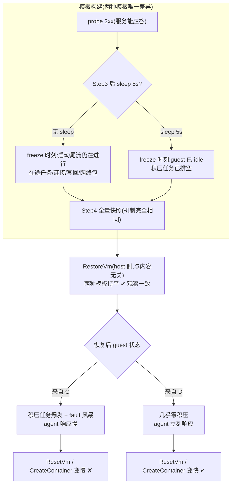

# 模板快照前 sleep 5s 使沙箱创建变快 — 5-Why 分析

> 调研时间:2026-09-13(代码级调研,关键结论附 file:line 出处)。关联笔记:[[cube-template-creation-flow]]。

**一句话结论**:sleep 改变的不是快照机制,而是快照**内容**——probe 2xx 是「服务能应答」而非「系统已安定」,无 sleep 的模板把应用启动尾流冻结进了快照;恢复后这些积压活动 + 懒恢复的页 fault 拖慢了所有「恢复后立即与 guest 交互」的 RPC(ResetVm / CreateContainer)。5s sleep 是无意中实现的「快照前静默期」。

---

## 一、现象

模板构建 AppSnapshot 流水线中,在 Step 3(建 CoW 内存卷)与 Step 4(cube-runtime 全量快照)之间插入 5s sleep:

- 该模板起的沙箱,cube-bench 测得的 create 延迟更低;
- 分阶段看,收益集中在 shim 埋点 **CreateContainer** 与 **ResetVm** 两个阶段;
- 其余阶段(尤其 **RestoreVm**)未见明显差异。

对照组 = 同镜像、同 probe 配置、无 sleep 的模板。

## 二、测量口径:这些阶段在代码里是什么

阶段数据来自 CubeShim 的 `StatDefer` 埋点(CubeShim/shim/src/log/stat_defer.rs:36-45),不是 cube-bench 自己的指标(cube-bench 只测 API 层 create/delete 总延迟,examples/cube-bench)。

| 阶段 | 代码位置 | 实际内容 |
|---|---|---|
| CreatePodSandbox | task_srv.rs:357 | 整个 containerd Create 调用的标签(沙箱未初始化时),内含 create_sandbox + create_container |
| RestoreVm | cube_hypervisor.rs:173-175 | **纯 host 侧** VMM restore 调用:加载 metadata、映射内存卷文件、恢复 vCPU |
| **ResetVm** | sb.rs:444(`reset_guest`) | **仅快照恢复路径执行**(sb.rs:486-488):两个 agent RPC——`SetGuestDateTime`(校时)+ `ReseedRandomDev`(RNG 重播种) |
| CreateSandbox | sb.rs:497 | agent `create_sandbox` RPC(网络/storage/路由) |
| **CreateContainer** | container/mod.rs:574 | agent `CreateContainer` RPC;恢复路径走 "create container by restore" 分支(rpc.rs:173-215):find 已恢复进程 → passfd 重连 stdio → 重置日志流 → mount propagation |

create_sandbox 内部顺序(sb.rs:472-538):`start_vm`(restore/boot + 等 VsockServerReady)→ `connect_agent` → **`reset_guest`(snapshot 时)** → agent create_sandbox。

关键事实:**ResetVm 与 CreateContainer 都是「VM 恢复后立刻与 guest 交互」的调用**;RestoreVm 是 host 侧工作,与 guest 内容无关。

## 三、5-Why

**Why 1:为什么 sleep 5s 模板起的沙箱更快?**
因为 create 路径中 CreateContainer 和 ResetVm 两个阶段耗时更短,其余阶段(RestoreVm 等)基本持平。

**Why 2:为什么这两个阶段会变短?**
这两个阶段的耗时主体是 agent RPC 的 vsock 往返 + **guest 侧执行速度**(找进程、mount propagation、处理两个系统调用)。host 侧开销固定,变短只可能来自 **guest 恢复后响应更快**。

**Why 3:为什么无 sleep 模板的 guest 恢复后响应更慢?**
恢复后 guest 立刻产生两波活动:① 冻结时刻的**在途任务恢复执行**——应用初始化尾流(连接池建立、后台线程、写回、网络栈处理中的包);② **懒恢复的页 fault 风暴**——guest 触碰的页都要现场从内存卷文件读。无 sleep 模板冻结的是「probe 刚 2xx」的忙碌时刻,恢复即还债;sleep 模板冻结的是 idle 5s 后的安静状态,恢复后几乎无债。

**Why 4:为什么「冻结时刻的活跃度」会变成「恢复后的债」?**
快照语义是「任意时刻整机冻结、恢复时原样继续」:在途活动不会消失,只会被推迟到恢复瞬间集中爆发。叠加懒恢复(按需读页),恢复瞬间的 CPU/IO 冲量全部落在 create 时间窗内,所有需要 guest 参与的 RPC 都被拖慢。

**Why 5:为什么系统会允许在「忙碌时刻」拍快照?**
因为模板构建的就绪契约只有 probe 2xx:「服务能应答 HTTP」≠「系统已静默」。probe 通过只说明服务 bind 成功,应用启动的尾部活动仍在进行;构建管线对「2xx 之后是否等待静默」没有语义,Step 4 立即 freeze。

**根因**:快照时机(就绪判定)不区分「能应答」与「已安定」,把应用启动尾流冻结进了模板;恢复路径的 guest 交互 RPC 被这部分「冻结的债」拖慢。5s sleep 是无意中实现的静默期,效果来自快照内容,不是快照机制。

## 四、机制模型

## 五、验证方法(按执行顺序)

| # | 目的 | 操作 | 预期(支持/否定哪一层) |
|---|---|---|---|
| V0 | 核对机制定位 | 对比两模板 **RestoreVm** 阶段耗时 | 持平 → 坐实「机制无关、内容有关」;若有差异 → 需重新考虑机制 |
| V1 | 排空曲线 | 梯度 sleep 0/1/2/5/10s,各建模板,N 轮交替测,画 ResetVm/CreateContainer vs sleep 曲线 | 1-2s 已获大部分收益并收敛 → 支持「在途活动排空」(Why 3);线性持续变好 → 另有机制 |
| V2 | 恢复后 guest 行为 | 两模板各起沙箱,恢复后立即以 ~50ms 间隔采样 guest `/proc/vmstat`(pgfault 增量)、`/proc/stat`(CPU) | 无 sleep 模板前几百 ms 有明显 fault/CPU 峰,sleep 模板平缓 → 直接证据 |
| V3 | 反向因果 | 在 Step 4 前主动给 guest 注入负载(持续压请求/写盘任务)再拍模板 | 预测 ResetVm/CreateContainer 变慢,方向与 sleep 相反 → 坐实「freeze 活跃度 → 恢复时延」因果 |
| V4 | 快照内容差异 | `du` 对比两模板 `tpl-<id>-memory` 卷文件实际占用;guest 内 `ss -s` 看 socket 数 | 若页数明显更少 → 叠加「dump 页数」机制(稀疏 dump);socket 更少 → 叠加 socket 清理机制 |
| V5 | 收益是否真实 | create 返回后立刻打首个业务请求,对比首请求延迟 | 若 sleep 模板首请求也快 → 收益是真实用户体验;若一样 → 收益只在阶段计时口径,需修正分析 |
| V6 | 排除噪声 | 同节点、同数据盘、宿主负载一致;A/B 交替多轮;报 p95 而非仅均值 | 排除缓存、磁盘状态、宿主抖动等混杂变量 |
| V7 | 工程化验证 | 把硬编码 sleep 替换为显式 `quiesce_grace_seconds` 构建参数(或收紧 probe 端点语义)后重测 | 复现 sleep 收益 → 证明根因可工程化解决,而非不可控的环境效应 |

## 六、结论与工程建议

**结论**:快照恢复的性能不只取决于「恢复机制」(那部分是常数),还取决于「冻结时刻的 guest 活跃度」——后者决定了恢复后所有 guest 交互 RPC 的响应性。probe 2xx 是必要的启动判据,但不是足够的「可拍快照」判据。

**建议(由近及远)**:

1. **收紧 probe 语义**:readiness 端点只在「初始化完全结束、进入稳态」后才返回 2xx(而不是能应答就算),让 2xx 时刻自然接近静默态;
2. **显式静默期参数**:模板构建 API 加 `quiesce_grace_seconds`,构建管线在 Step 4 前按参数等待,语义可读、可调,替代硬编码 sleep;
3. **恢复路径缓解(治标)**:restore 后优先调度 agent / 预取工作集页,可降低债的影响但不消除债。

## 附:关键代码引用

- 埋点定义:`CubeShim/shim/src/log/stat_defer.rs:36-45`
- ResetVm = reset_guest(校时+RNG 重播种):`CubeShim/shim/src/sandbox/sb.rs:438-470`,仅 snapshot 路径执行:`sb.rs:486-488`
- create_sandbox 顺序:`sb.rs:472-538`;start_vm / restore_vm:`sb.rs:866-935`
- RestoreVm:`CubeShim/shim/src/hypervisor/cube_hypervisor.rs:173-175`
- CreateContainer:`CubeShim/shim/src/container/mod.rs:574`;restore 分支:`agent/src/rpc.rs:173-215`
- Step3 建卷 / Step4 快照:`Cubelet/services/cubebox/appsnapshot.go:264-313`
- cube-bench 口径:`examples/cube-bench`(API 层 create/delete 总延迟)
