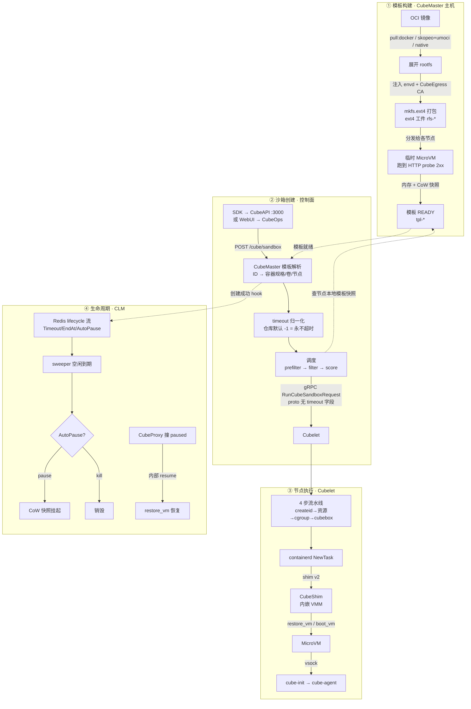
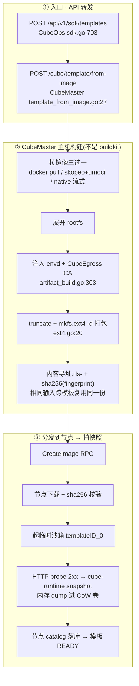
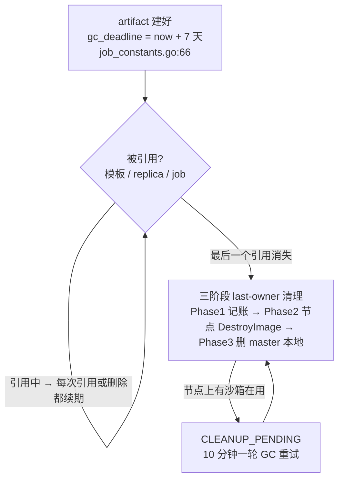
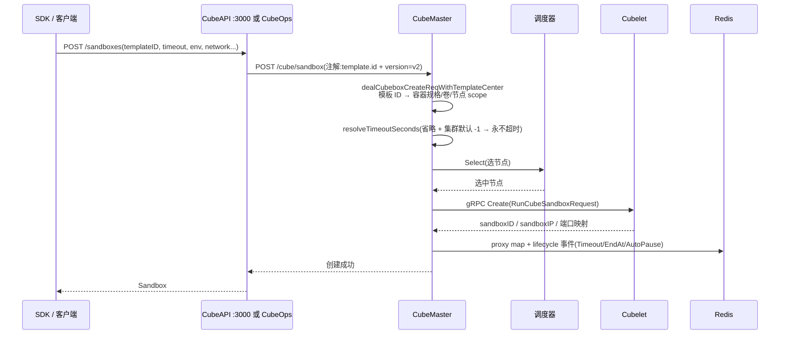
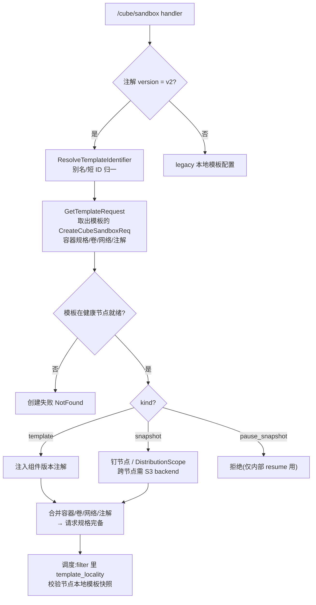
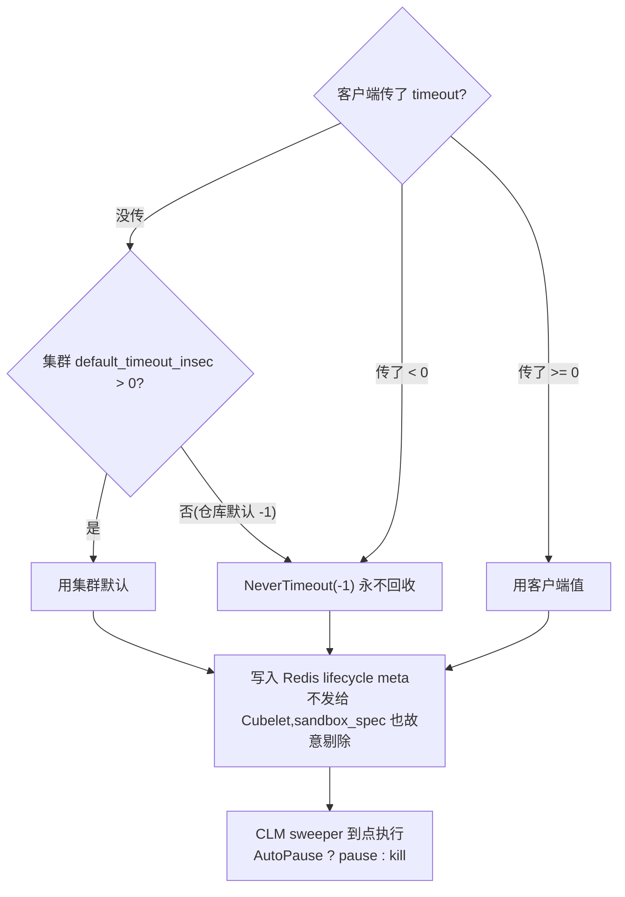
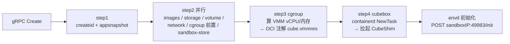
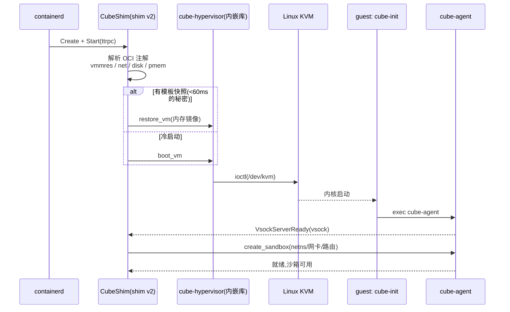
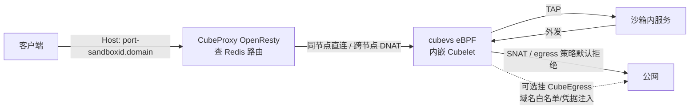
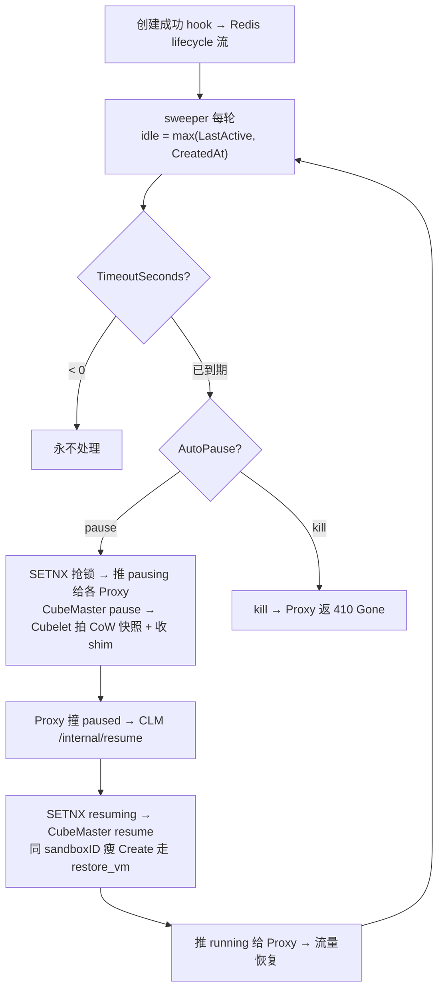

# CubeSandbox 模板创建 & 沙箱启动全链路

> 调研时间:2026-09-09(代码级调研,关键结论附 file:line 出处)。

**一句话结论**:模板 = 「OCI 镜像展开后的 ext4 rootfs」+「各节点 probe 2xx 后拍的 MicroVM 内存+文件系统快照」。开沙箱 = 从这份快照恢复一台轻量 VM,而不是像容器那样跑镜像。

---

## 一、全景图

图例:实线 = 主调用流;虚线 = 状态读写 / 就绪依赖。①–④ 对应下文四节。

---

## 二、模板是怎么造出来的(4 条途径)

| 途径 | 入口 API | 产物语义 |
|---|---|---|
| **A. OCI 镜像构建**(主路径) | CubeOps `POST /api/v1/sdk/templates`(sdk.go:703)→ CubeMaster `POST /cube/template/from-image` | ext4 rootfs + 各节点内存快照 |
| **B. commit 运行中沙箱** | `POST /cube/sandbox/commit`(template_commit.go:57) | 单节点 1 副本,其余 PARTIALLY_READY |
| **C. 用户快照** | `POST /cube/snapshot` → `SubmitSandboxSnapshot` | `snap-*`,可回滚/克隆/再开沙箱 |
| **D. legacy** | `POST /cube/template`(传 CreateCubeSandboxReq) | 新前端/SDK 已不走 |

### 途径 A 构建流水线

**要点**:构建发生在 CubeMaster 主机上;节点只负责下载 ext4、起临时 VM、拍快照。模板"内容"由 probe 决定——是"MicroVM 起来后等 probe 2xx 才冻的 fs+memory",不是进程刚启动的镜像。

### 产物 GC(7 天 TTL 是"从最后引用起算")

---

## 三、控制面:用模板创建沙箱

### 创建时序(两条入口汇聚同一端点)

> 两条入口的差别:直接 SDK 经 **CubeAPI**(3000 端口,字段映射最全:env_vars→create_time_env_vars、lifecycle→auto_pause);WebUI/AgentHub 经 **CubeOps**,只转发 templateID/timeout/autoPause/metadata。Go SDK 目前没有 lifecycle 选项,只有 Python SDK 有。

### 模板解析(唯一落点,进入调度前同步完成)

关键点:物理卷引用**不下发**给 Cubelet,只传逻辑 ID + backend,由 Cubelet 按 `RuntimeSnapshotID` 查本地 catalog(cubeboxutil.go:584-591)——防跨租户注解注入。

### timeout 的归一化与落点

---

## 四、节点侧:沙箱真正跑起来

### Cubelet 四步流水线

### VM 启动(有快照走 restore,没快照冷启动)

> 设备形态:virtio-net(host TAP,fd 经 unix socket SCM_RIGHTS 交接)、virtio-blk、virtiofs、**pmem0=guest OS 镜像、pmem1=cube-agent.ext4**、vsock。guest 的 `/sbin/init` 就是 cube-init。

### 网络数据面(访问沙箱 & 沙箱外发)

---

## 五、生命周期接管(CLM)

> Proxy 状态门:`pausing→503 Retry-After`、`paused→内部 resume 子请求`、`killed→410`。用户访问被暂停的沙箱时,resume ~100ms,基本无感。

---

## 六、勘误清单(最容易误解的 5 点)

1. **CubeOps 的 warehouse(S3 blobstore/tar.gz 上传)与模板无关**——它是节点组件(agent 一键包)仓库。模板 rootfs 存在 CubeMaster 本机磁盘,经 CubeMaster 自己的 HTTP 端点下发。
2. **模板不是 OCI 镜像,是 VM 快照**:开沙箱是"从模板快照恢复 MicroVM"(docs/guide/templates.md:11)。
3. **构建工具不是 buildkit**:CubeMaster 主机上的 docker / skopeo+umoci + `mkfs.ext4 -d`;仓库没有 Dockerfile 构建入口。
4. **模板 ID 规格不可变**:同 ID 重提不同规格会报错(template_image.go:124-129),要改规格换新 ID 或 redo。
5. **状态存储分散**:业务状态机分在 CubeMaster 实例缓存表(`t_cube_instance_info.ins_state`)、Redis lifecycle state(CLM 视角)、节点本地 cubeboxstore 三处,不在 CubeDB 的某张 sandbox 表里。

---

## 附:常见疑问——沙箱有默认生存时间吗?

**没有。** 仓库出厂 `default_timeout_insec: -1`(configs/single-node/cubemaster.yaml:32),客户端不传 `timeout` 的沙箱**永不因空闲被回收**:

| 传入值 | 行为 |
|---|---|
| 省略 | 集群 `default_timeout_insec`;仓库默认 -1 → 永不超时 |
| `NEVER_TIMEOUT`(-1) | 永不超时 |
| `0` | 立即回收 |
| 正整数 N | 空闲 N 秒后触发(`on_timeout` 默认 kill,可设 pause) |

归一化唯一落点:`resolveTimeoutSeconds`(CubeMaster/pkg/service/sandbox/util.go:254);执行端是 CLM sweeper。集群运维把 `default_timeout_insec` 改为正数(如 300)即可自动回收不传 TTL 的沙箱,需重启 CubeMaster。
