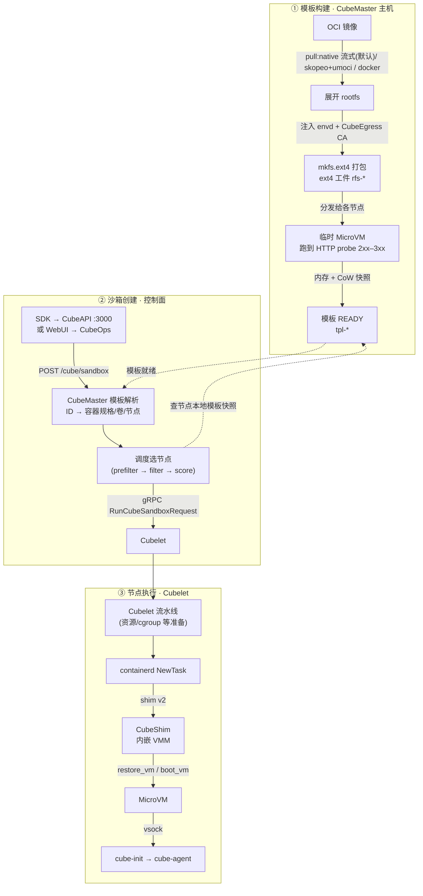
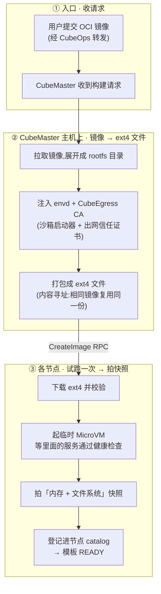
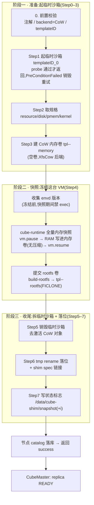
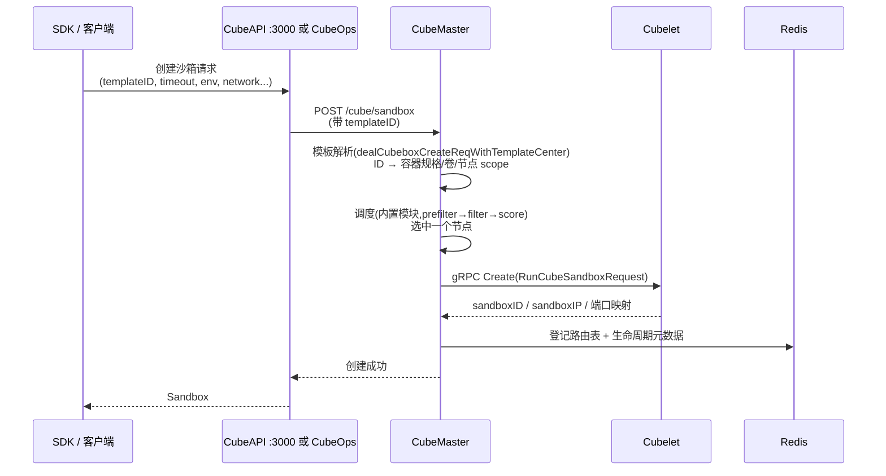
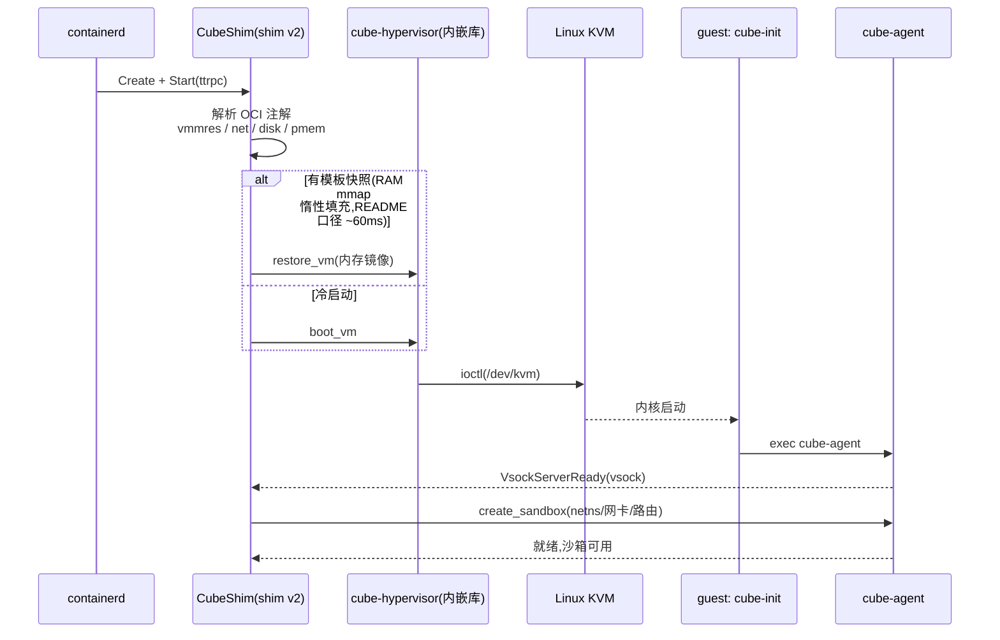
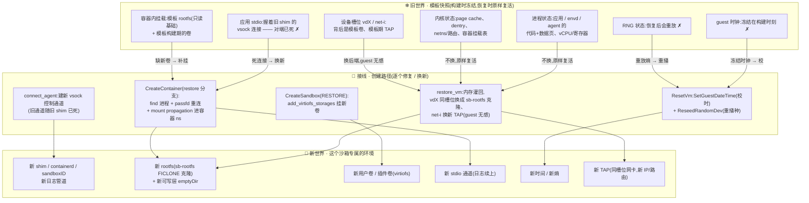

# CubeSandbox 模板创建 & 沙箱启动全链路

> 调研时间:2026-09-09(代码级调研,关键结论附 file:line 出处);2026-09-13 对照 HEAD f7b2317c 勘误修订:修正文件路径与语义误差,全文精简为「模板创建 + 沙箱通过模板启动」两条主线。

**一句话结论**:模板 = 「OCI 镜像展开后的 ext4 rootfs」+「各节点 probe 200–399 后拍的 MicroVM 内存快照 + reflink rootfs 卷」。开沙箱 = 恢复内存与设备状态(文件系统是 CoW 克隆,不是快照恢复),而不是像容器那样跑镜像。

---

## 一、全景图

图例:实线 = 主调用流;虚线 = 状态读写 / 就绪依赖。①–③ 对应下文三节。

---

## 二、模板是怎么造出来的(OCI 镜像构建)

**一句话**:把 OCI 镜像交给 Cube,Cube 先把它展开成 ext4 根文件系统,再在每个节点上起一台临时 MicroVM、等沙箱里的服务通过健康检查后拍下「内存 + 文件系统快照」——这份"预热好的存档"就是模板。

### 构建流水线

**要点**:构建发生在 CubeMaster 主机上;节点只负责下载 ext4、起临时 VM、拍快照。模板"内容"由 probe 决定——是"MicroVM 起来后等 probe 200–399 才冻的 fs+memory"(默认 GET :port/health、30s 预算、500ms 周期、连续失败 60 次放弃),不是进程刚启动的镜像。

### 节点侧执行:AppSnapshot 步骤

> ③ 里「起临时沙箱 → probe → 快照 → catalog 落库」在节点上的具体实现是 Cubelet 的 `service.AppSnapshot`(Cubelet/services/cubebox/appsnapshot.go:57),完整步骤:

> 失败保护:`forceDestroyCubebox` 闭包在 appsnapshot.go:187-206,真正的 defer 注册在 :208-212(`!snapshotSuccess && !temporaryCubeboxDestroyed` 时 force destroy),任何一步失败都先清理再报错。注意该 defer 在 Create **成功之后**才注册;Create 失败(含 probe 失败)由 Cubelet workflow 的 failover 清理。

## 三、控制面:用模板创建沙箱

### 创建时序(三条入口汇聚同一端点)

> 入口实为三条:直接 SDK 经 **CubeAPI**(3000 端口,字段映射最全:env_vars→create_time_env_vars、lifecycle→auto_pause);**WebUI** 经 CubeOps,只转发 templateID/timeout(>0)/autoPause/metadata;**AgentHub** 经 CubeOps 的另一条路(agenthub.go:246-293),另转发 network_config/distribution_scope,timeout 硬编码 86400。Go SDK 目前没有 lifecycle 选项,只有 Python SDK 有。

---

## 四、节点侧:沙箱真正跑起来

### VM 启动(有快照走 restore,没快照冷启动)

> 设备形态:virtio-net(host TAP,fd 先从 Cubelet tap 池取——unix socket SCM_RIGHTS,失败才 open /dev/net/tun)、virtio-blk(业务数据卷 → guest `/dev/vdX`)、virtiofs(tag cubeShared,插件卷/共享目录)、**pmem0=ext4 rootfs 镜像(`root=/dev/pmem0 rootflags=dax,ro`;内核是独立 vmlinux,由 VMM load_kernel 加载)、pmem1=cube-agent.ext4(guest 挂 `/run/support`)**、vsock。guest 的 `/sbin/init` 就是 cube-init。

### 恢复视图:快照里什么是旧的、什么是新的

> 从模板恢复沙箱的本质是「旧世界原样复活 + 现场接线」:进程/内核/挂载状态照单全收(快照的收益),stdio/时钟/熵/设备后端逐项换新(快照的代价)。「换新」全部通过恢复后的 guest 内 RPC 执行(ResetVm / CreateSandbox / CreateContainer 恢复分支)——这就是「冻结时刻 guest 活跃度 → 恢复时延」的落点。

**读图要点**:三样「原样复活、不换」——进程状态、内核状态、容器内模板挂载(快照的全部价值);五样「现场换新/补新」:

| 旧的(冻在快照里) | 为什么必须换 | 换新动作 |
|---|---|---|
| stdio vsock 连接 | 对端旧 shim 已死 | passfd 重连 |
| 容器 ns 缺新卷 | 新沙箱有专属可写层/用户卷 | mount propagation |
| guest 时钟 | 冻结在构建时刻 | SetGuestDateTime |
| RNG 状态 | 所有沙箱会重放同一随机序列 | ReseedRandomDev |
| 设备后端(vdX / TAP) | 模板卷被共享、网卡接新网络 | 同槽位换后端(guest 无感) |

关键不对称:「不换」的是快照的收益来源,「必须换」的是快照的代价来源——代价全部通过恢复后的 guest 内执行支付。

