# GICv5 架构与实现笔记

> 三部分：架构模型 → 中断路由详解 → 软件配置与实现
> 内核主线 master (fc46aed51f6)，规范 ARM-AES-0070 00bet2

---

## 一、架构模型

### 1.1 组件全景

GICv5 由四种硬件组件构成：

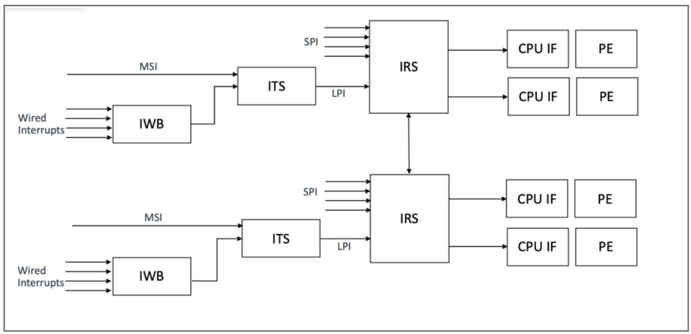

```
┌──────────────────────────────────────────────────────────────────────────────────────────────────────────────────────┐
│                                        GICv5 Hardware & Memory Structure                                            │
│                                                                                                                      │
│ ┌────────────────┐  ┌────────────────┐  ┌────────────────┐  ╔═══════════════════════════════════════════════════════╗ │
│ │      PE 0      │  │      PE 1      │  │      PE N-1    │  ║ Memory (software-allocated tables)                   ║ │
│ │ ┌────────────┐ │  │ ┌────────────┐ │  │ ┌────────────┐ │  ║                                                     ║ │
│ │ │ CPU-IF     │ │  │ │ CPU-IF     │ │  │ │ CPU-IF     │ │  ║ ┌───────────────────────┐ ┌───────────────────────┐ ║ │
│ │ │ ICC/ICV    │ │  │ │ ICC/ICV    │ │  │ │ ICC/ICV    │ │  ║ │  Physical LPI IST     │ │  VM Table             │ ║ │
│ │ │ HPPI arb   │ │  │ │ HPPI arb   │ │  │ │ HPPI arb   │ │  ║ │  <- IRS R/W           │ │  L2_VMTE[VM_ID]       │ ║ │
│ │ └─────┬──────┘ │  │ └─────┬──────┘ │  │ └─────┬──────┘ │  ║ └───────────────────────┘ └───────────────────────┘ ║ │
│ └───────┼────────┘  └───────┼────────┘  └───────┼────────┘  ║                                                     ║ │
│         │                    │                    │          ║ ┌───────────────────────┐ ┌───────────────────────┐ ║ │
│         └───────────────────┴───────────────────┴          ║ │  VPE Table (per VM)   │ │  VPE Descriptor       │ ║ │
│           IRI Link (GICv5 Stream Protocol)                 ║ │  VPETE[] -> VPE Desc  │ │  (per VPE, IRS work)  │ ║ │
│                             │                              ║ └───────────────────────┘ └───────────────────────┘ ║ │
│                             │                              ║                                                     ║ │
│   ┌───────────────────────────────────────────────┐       ║ ┌───────────────────────┐ ┌───────────────────────┐ ║ │
│   │ IRS: SPI state & routing, HPPI, residency    │──────►║ │  vLPI IST (per VM)    │ │  vSPI IST (per VM)    │ ║ │
│   │ VPE residency, doorbell eval, VM/VPE mgmt    │       ║ │  En/Pr/Pend/Rtg(VPE)  │ │  <- IRS R/W           │ ║ │
│   └───────┬───────────────────┬─────────────────────┘       ║ └───────────────────────┘ └───────────────────────┘ ║ │
│           │                   │                             ║                                                     ║ │
│  ┌──────────────┐  ┌───────────────────────┐                ║ ┌───────────────────────┐ ┌───────────────────────┐ ║ │
│  │ SPI-wired     │  │ ITS: DT/ITT lookup     │──────────────►║ │  ITS DT (per ITS)     │ │  ITT xN (per device)  │ ║ │
│  │ (direct wire) │  │                       │                ║ │  DTE[]  <- ITS R/W    │ │  ITTE[] -> LPI INTID  │ ║ │
│  └──────────────┘  └───────────┬───────────┘                ║ └───────────────────────┘ └───────────────────────┘ ║ │
│                                │                            ║                                                     ║ │
│                    ┌─────────────┐  MSI write               ║                                                     ║ │
│                    │ wire->event │  PCIe endpoint           ║                                                     ║ │
│                    └──────┬──────┘                          ║                                                     ║ │
│                           │                                 ║                                                     ║ │
│                      wired device                          ║                                                     ║ │
│                                                            ╚═══════════════════════════════════════════════════════╝ │
└──────────────────────────────────────────────────────────────────────────────────────────────────────────────────────┘
```

> 图注：IRS/ITS/IWB 各画一个为代表（实际可多个）；doorbell LPI 是普通物理 LPI，经物理 IST + IRI Link 投递；表的基地址由软件写入 IRS_*_BASER / ITS_DT_BASER 后硬件接管。

| 组件 | 一句话职责 | 输入 | 输出 |
|------|-----------|------|------|
| **IWB** | 将有线电平/边沿信号转换为 ITS 事件 | 物理 wire 断言 | `(DeviceID=本IWB, EventID=wire编号, Event=SET_EDGE/SET_LEVEL/CLEAR)` |
| **ITS** | 将 `(DeviceID, EventID)` 翻译为 LPI INTID | ITS 事件 | `(LPI_INTID, EventType, VM_ID可选)` |
| **IRS** | 维护中断状态，路由到目标 PE | ITS 翻译后的中断事件 | 候选 HPPI → CPU-IF |
| **CPU-IF** | 管理 PPI，做最终 HPPI 仲裁，收发 GSP 消息 | IRS 候选 HPPI + 本地 PPI | IRQ/FIQ 信号 → PE |

一个 SoC 内可以有多个 IWB、ITS、IRS。典型布局：每个 chiplet 一个 IRS，每个 PCIe root complex 的 ITS 与一个 IRS 关联，IWB 与 ITS N:1 连接。IWB、ITS、IRS 的集合统称为 **IRI（Interrupt Routing Infrastructure）**。

CPU-IF 通过 **IRI Link** 连接到 IRS，CPU-IF 负责四件事：① 管理 PPI 的配置与状态；② 屏蔽中断并将通过优先级规则的中断信号发送给 PE；③ 为软件提供应答、去激活和配置中断的接口；④ 支持虚拟化——EL2 存在时同时处理物理和虚拟中断。

**中断域（Interrupt Domains）**：GICv5 定义四个独立的物理中断域，各自拥有独立的 HPPI、Priority Mask、Running Priority。IRS、ITS、IWB 对每个域提供独立的 MMIO 配置帧：

```
┌──────────┐  ┌──────────┐  ┌──────────┐  ┌──────────┐
│   EL3    │  │  Secure  │  │ Non-secure│  │  Realm   │
│  Domain  │  │  Domain  │  │  Domain   │  │  Domain  │
│ (EL3固件)│  │(SPM/Trust│  │(Hypervisor│  │  (RMM)   │
│          │  │   Zone)  │  │   /OS)    │  │          │
└──────────┘  └──────────┘  └──────────┘  └──────────┘
```

PE 不实现某 Security state 则对应域不存在。所有 PE 必须实现相同的 Security states。

---

### 1.2 中断类型

三种类型通过 **INTID** 区分。INTID 是 32 位值：`bits[31:29] = Type`，`bits[28:0] = ID`。

| | PPI | SPI | LPI |
|---|-----|-----|-----|
| **含义** | Private Peripheral Interrupt | Shared Peripheral Interrupt | Locality-specific Peripheral Interrupt |
| **可见范围** | 仅本 PE | 全局，可路由到任意 PE | 全局，可路由到任意 PE |
| **数量** | 每 PE 0-127（0-63 架构定义，64-127 实现定义） | 全局固定，由 IRS 硬件决定（IRS_IDR5..7 上报） | 由 `IRS_IST_CFGR.LPI_ID_BITS` 决定（2^N 个），软件可在硬件上限内编程 |
| **状态存储** | CPU-IF 系统寄存器 (`ICC_PPI_*_EL1`) | IRS 内部寄存器 | 软件分配的系统内存 (IST) |
| **配置接口** | 系统寄存器 | IRS MMIO 选择后，GIC 系统指令 | GIC 系统指令 |
| **早期启动可用** | 是 | 是（无需内存，启动早期即可用） | 否（需要内存初始化） |
| **虚拟化** | vPPI, 直接注入 (DVI) | vSPI, IRS_SPI_VMR 映射或 VDPEND 注入 | vLPI, ITS 翻译指定 VM_ID |

**INTID 命名空间规则**（ARM 官方文档明确）：

- LPI 的 ID 命名空间**每中断域独立**：Non-secure 域的 LPI #42 和 Secure 域的 LPI #42 是不同中断
- SPI 和 PPI 的 ID 命名空间**跨域共享**：每个 SPI/PPI 被分配给特定域，仅在分配域内可见，域分配由 EL3 软件动态控制

**IPI（核间中断）**：GICv5 没有专用的 SGI。SPI 或 LPI 都可以配置为 IPI——设置为 Edge 触发 + Targeted 路由，发送方执行 `GIC CDPEND` 置 pending 即可。

---

### 1.3 中断状态

每个 INTID 维护两个独立的状态位——Pending 和 Active 是分开的，不像传统设计用单一状态属性同时编码两者。

| 状态位 | 含义 | 取值 |
|--------|------|------|
| **Pending** | 中断是否被源端触发 | Idle（未触发）/ Pending（已触发） |
| **Active** | 中断是否正在被软件处理 | Inactive（未处理）/ Active（处理中） |

**Edge-triggered 状态机**：

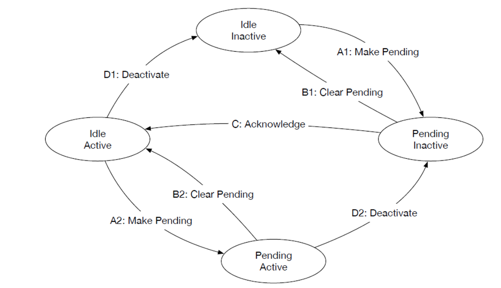

转换规则：
  - SET_EDGE: 硬件或软件（CDPEND）触发 → 置 Pending=1
  - CDIA 应答: 置 Active=1，同时自动清 Pending=0
  - CDDI 去激活: 清 Active=0


**Level-sensitive 状态机**：

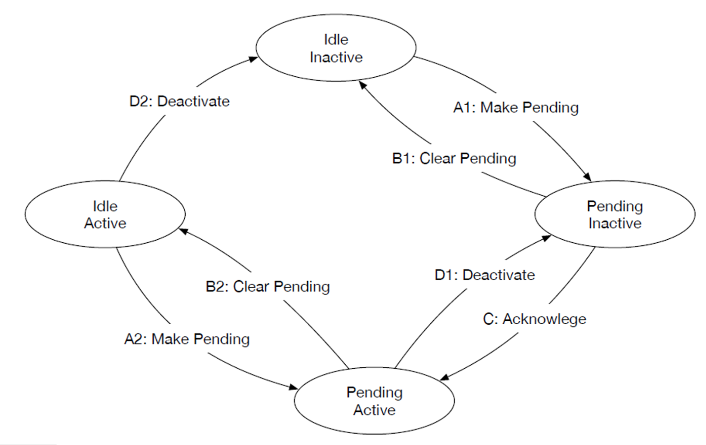

转换规则（与 Edge 的关键差异）：
  - signal asserted: 源端拉高电平 → 置 Pending=1
  - signal de-asserted: 源端拉低电平 → 清 Pending=0（从任意状态！）
  - CDIA 应答: 置 Active=1，但不自动清 Pending——Pending 仍由物理电平决定
  - CDDI 去激活: 清 Active=0

**两种触发方式的对比**：

| | Edge-triggered | Level-sensitive |
|---|---------------|-----------------|
| Pending 置位 | SET_EDGE 事件（硬件边沿检测或 CDPEND） | 物理电平 asserted |
| Pending 清零 | CDIA 应答时自动清零 | 仅源端 de-assert 时清零（ACK 不影响） |
| Handler 内再次触发 | 新边沿 → [Pending, Active] | 电平持续 asserted → 保持 [Pending, Active] |
| 中断丢失风险 | 边沿可能在 handler 结束前到来，此时处于 Active 仍可再次 Pending，不会丢失 | 如果 handler 结束前电平已 de-assert，中断"消失"（软件可能看不到） |
| 典型用途 | MSI、IPI、定时器 | 传统有线设备（如 UART、GPIO） |

**四个状态（ARM 官方文档定义）**：

| 状态 | Pending | Active | 含义 |
|------|---------|--------|------|
| **Idle, Inactive** | 0 | 0 | 无中断 pending，无 handler 运行 |
| **Pending, Inactive** | 1 | 0 | 中断已触发，等待 PE 应答 |
| **Idle, Active** | 0 | 1 | handler 运行中，源端已不再触发 |
| **Pending, Active** | 1 | 1 | handler 运行中，源端再次触发（Edge）或电平仍 asserted（Level） |

---

### 1.4 GIC 系统指令集

所有 LPI/SPI 的配置和操作都通过 GIC 系统指令完成。指令格式 `GIC <domain>OP, Xt`：

| Domain | 全称 | 含义 | 可用 EL |
|--------|------|------|---------|
| **CD** | Current Domain | 当前 EL 对应的物理中断域 | 所有 |
| **VD** | Virtual Domain | Guest VM 的虚拟中断域 | EL2, EL3 |
| **LD** | Logical Domain | SCR_EL3.{NS,NSE} 选择的域 | EL3 only |

指令（以 CD 前缀为例）：

| 指令 | 操作 | 对中断状态的影响 |
|------|------|-----------------|
| `GICR CDIA` | 应答 HPPI（非 NMI） | VALID=1 时：设 Active=1；Edge 触发则清 Pending=0；在 ICC_APR 中标记优先级；返回 INTID |
| `GICR CDNMIA` | 应答 HPPI（仅 NMI） | 同上，但仅对 priority=0x00 且 SCTLR.NMI=1 的中断有效 |
| `GIC CDEOI` | Priority Drop | 清除 ICC_APR 中最高 active 优先级，降低 Running Priority |
| `GIC CDDI, Xt` | Deactivate | 设 Active=0。Xt 编码与 CDIA 返回值兼容（VALID 位被忽略） |
| `GIC CDEN, Xt` | Enable | 设 Enable=1 |
| `GIC CDDIS, Xt` | Disable | 设 Enable=0；如果该中断是当前 HPPI 则召回（recall） |
| `GIC CDAFF, Xt` | 设置 Affinity | 设置路由目标 PE 的 IAFFID（Targeted）或 1ofN 模式 |
| `GIC CDPRI, Xt` | 设置 Priority | 设 5-bit 优先级（0=最高/NMI，31=最低） |
| `GIC CDPEND, Xt` | 设置/清除 Pending | Xt.Pending=1 则 SET，=0 则 CLEAR |
| `GIC CDHM, Xt` | 设置 Handling Mode | Edge 或 Level（PPI 的 Handling Mode 硬件固定，不可编程） |
| `GIC CDRCFG, Xt` | 读取配置和状态 | 结果间接写入 ICC_ICSR_EL1（需 ISB 后 MRS 读取） |

**关键规则**：
- **CDIA 和 CDNMIA 是唯二能置 Active=1 的指令**，没有其他 GIC 指令可以设置 Active 状态
- **CDIA 决不应答 NMI**：当 priority=0x00 且 SCTLR.NMI=1，CDIA 返回 VALID=0
- **CDNMIA 仅应答 NMI**：当 priority≠0x00 或 SCTLR.NMI=0，CDNMIA 返回 VALID=0
- **不可达 INTID（unreachable INTID）**：超出 IST 范围的 LPI INTID 等，GIC 指令视为 NOP（IRI 可能记录 SW 错误）
- **配置副作用不保证立即可见**：CDDIS 等指令 retire 不代表副作用已传播完成，需要 GSB 同步
- **CDRCFG 使用模式**：`GIC CDRCFG, x5` → `ISB` → `MRS x0, ICC_ICSR_EL1`（ISB 确保间接写入对后续直接读取可见）

---

### 1.5 关键数据结构

**IST — Interrupt State Table**（由 IRS 维护，存储 LPI 状态）：

```
线性 IST：                                         二级 IST：
┌───┬───┬───┬───┬───┐                             ┌────────────────────┐
│ E0│ E1│ E2│ E3│...│  N = 2^LPI_ID_BITS           │ L1 IST              │
└───┴───┴───┴───┴───┘                             │ L1E[0..N-1]         │
                                                   │  └ GPA of L2 + VALID│
每个 L2 Entry 包含：                                └───┬────────────────┘
  - Enable (1b)                                         │ 按需分配
  - Priority (5b)                              ┌────────┴─────────┐
  - Pending (1b)                               │ L2 IST A│ L2 IST B│...
  - Routing info (Targeted IAFFID / 1ofN)      └─────────┴─────────┘
```

- 软件通过 `IRS_IST_CFGR` 配置 LPI_ID_BITS、结构（线性/二级）、ISTSZ、L2SZ
- 软件通过 `IRS_IST_BASER` 提供物理基地址，写 VALID=1 后 IRS 接管
- **一旦 VALID=1，软件不能再直接访问 IST**；所有 LPI 状态更新必须通过 GIC 系统指令

**ITS Device Table + ITT**：

```
DeviceID
  │
  ▼
┌───────────────────┐
│ Device Table (DT)  │  基地址: ITS_DT_BASER, 配置: ITS_DT_CFGR
│ DTE[DeviceID]      │
│ ├ ITT_ADDR         │  指向 ITT 物理地址
│ ├ EVENT_ID_BITS    │  该设备支持的事件数 = 2^bits
│ ├ ITT_STRUCTURE    │  线性 or 二级
│ ├ L2SZ (if 二级)   │
│ └ VALID            │
└────────┬──────────┘
         │
         ▼
┌───────────────────┐
│ ITT (per device)   │  软件为每个设备分配
│ ITTE[EventID]      │
│ ├ LPI_ID           │  映射到的 LPI INTID
│ ├ VIRTUAL          │  是否虚拟中断
│ ├ VM_ID (if VIRT)  │  目标 VM
│ └ VALID            │
└────────────────────┘
```

**VM/VPE 表（虚拟化）**：

```
IRS_VMT_BASER → VM Table
  └ L2_VMTE[VM_ID]
      ├ VPE Table 基地址 → VPETE[VPE_ID] → VPE Descriptor
      ├ Virtual LPI IST 基地址 + 配置
      └ Virtual SPI IST 基地址 + 配置
```

---

## 二、中断路由详解

### 2.1 LPI 完整路径（从 MSI 写入到 IRQ Handler 返回）

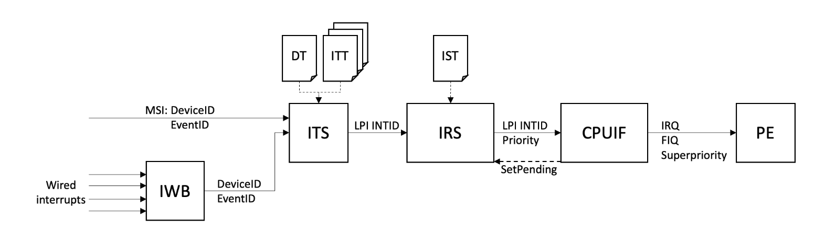

#### Step 1a：MSI 写事务 → ITS

PCIe 设备通过写 MSI Message 直接触发 ITS 事件：

```
设备写（PCIe Memory Write TLP）：
  Address = GITS_TRANSLATE 物理地址（gicv5_its_compose_msi_msg 填入）
  Data    = EventID（软件分配的事件号）

ITS 从总线事务中提取：
  DeviceID  ← 硬件从总线事务派生（PCIe: Requester ID）
  EventID   ← 写入的 Data 值
  Event     ← SET_EDGE（MSI 写本身就是边沿，ITS 硬件硬编码，不从任何寄存器读取）
  Domain    ← ITS 翻译寄存器所在地址空间的 PAS（Physical Address Space）
```

在中断使能时，`gicv5_its_compose_msi_msg` 预先将 MSI Address 和 Data 写入设备的 MSI-X Table 或 MSI Capability 寄存器：

```c
// drivers/irqchip/irq-gic-v5-its.c:717
static void gicv5_its_compose_msi_msg(struct irq_data *d,
                                       struct msi_msg *msg)
{
    struct gicv5_its_dev *its_dev = irq_data_get_irq_chip_data(d);

    // MSI Data = EventID（设备发中断时写入的值）
    msg->data = FIELD_GET(GICV5_ITS_HWIRQ_EVENT_ID, d->hwirq);

    // MSI Address = ITS 翻译帧物理地址（设备发中断时写入的目标地址）
    msi_msg_set_addr(desc, msg, its_dev->its_trans_phys_base);
}
```

设备触发中断时，执行一次 PCIe Memory Write → 硬件路由到 ITS → ITS 收到事件 `{DeviceID, EventID, SET_EDGE, Domain}`。

#### Step 1b：有线中断 → IWB → ITS

如果 LPI 的源头是有线设备（非 MSI），则先经过 IWB 转换：

```
外部设备
  │
  │ 物理 wire（电平或边沿信号）
  ▼
┌────────────────────────────────────────────────────────────┐
│  IWB (Interrupt Wire Bridge)                               │
│                                                            │
│  每个 wire 独立配置：                                        │
│    IWB_WTMR<n>     → 触发类型：Edge-triggered / Level-sensitive │
│    IWB_WDOMAINR<n>  → 中断域：Non-secure / Secure / Realm / EL3  │
│    IWB_WENABLER<n>  → 使能：1 = 启用监测                      │
│                                                            │
│  IWB 硬件行为：                                              │
│    WTMR=Edge  + wire 出现边沿  → 生成 Event = SET_EDGE     │
│    WTMR=Level + wire 拉高     → 生成 Event = SET_LEVEL    │
│    WTMR=Level + wire 拉低     → 生成 Event = CLEAR        │
│                                                            │
│  构造 ITS 事件：                                             │
│    DeviceID = 本 IWB 的唯一标识（系统设计时分配，固件上报）     │
│    EventID  = wire 编号（硬件固定，与 wire 一一对应）          │
│    Event    = 上述判定结果                                   │
│    Domain   = IWB_WDOMAINR<n> 配置的域                      │
└────────────────────────┬───────────────────────────────────┘
                         │
                         │ ITS 事件 {DeviceID, EventID, Event, Domain}
                         ▼
                       ITS
```

**IWB 的关键约束**：
- 每个 IWB 有唯一 DeviceID，在与之关联的 ITS 的 DT 中必须有对应的 DTE
- DeviceID 和 EventID（wire 编号）都是硬件固定的 → IWB domain 使用 `MSI_ALLOC_FLAGS_FIXED_MSG_DATA`
- 每个 IWB 只连接到一个 ITS

IWB 的 DeviceID 有 DTS/ACPI 表设定提供，在 IWB 驱动 probe 时，便会创建好 DTE。

**内核 IWB 配置代码**：

```c
// drivers/irqchip/irq-gic-v5-iwb.c
// 设置触发类型
static int gicv5_iwb_set_type(struct irq_data *d, unsigned int type)
{
    // 读 IWB_WTMR[n]，根据 IRQ_TYPE_LEVEL_* / IRQ_TYPE_EDGE_* 置位或清零
}

// 使能 wire
static void gicv5_iwb_irq_enable(struct irq_data *d)
{
    gicv5_iwb_enable_wire(iwb_node, d->hwirq);
    // → __gicv5_iwb_set_wire_enable() → 写 IWB_WENABLER[n]
    // → gicv5_iwb_wait_for_wenabler() → poll IWB_WENABLE_STATUSR.IDLE
    irq_chip_enable_parent(d);  // 调用父 MSI domain 的 enable
}
```

**软件配置一个 IWB 有线中断的完整步骤**（ARM 官方文档）：

| 步骤 | 操作 | 寄存器 |
|------|------|--------|
| 1 | 分配中断域 | `IWB_WDOMAINR<n>`：Non-secure / Secure / Realm / EL3 |
| 2 | 配置触发类型 | `IWB_WTMR<n>`：Edge 或 Level，需与外部设备信号匹配 |
| 3 | 安装 ITS 翻译 | 确保 ITS 的 DT 中有该 IWB 的 DTE，ITT 中有对应 EventID→LPI INTID 的 ITTE |
| 4 | 使能 wire | `IWB_WENABLER<n>` |

#### Step 2：ITS 翻译 —— Device Table 查找

ITS 用 DeviceID 索引 Device Table：

```
DTE = DeviceTable[DeviceID]

if (!DTE.VALID)
    → 软件错误，ITS_SWERR_STATUSR 报告
    返回

ITT_base = DTE.ITT_ADDR
event_id_bits = DTE.EVENT_ID_BITS
```

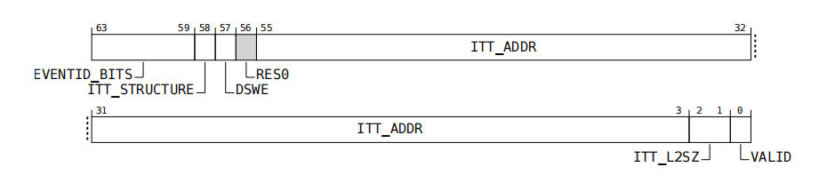

**DTE 写入（设备注册时）**：

```c
// drivers/irqchip/irq-gic-v5-its.c:525-531 (gicv5_its_device_register)
dt_entry =  (u64)event_id_bits << GICV5_ITS_DTE_EVENT_ID_BITS_SHIFT |
            (u64)itt_structure   << GICV5_ITS_DTE_ITT_STRUCTURE_SHIFT |
            (u64)l2sz            << GICV5_ITS_DTE_ITT_L2SZ_SHIFT |
            its_dev->itt_cfg.itt_phys_addr |
            GICV5_ITS_DTE_VALID;

its_write_table_entry(its, dte, dt_entry);
// → WRITE_ONCE + dcache clean

gicv5_its_device_cache_inv(its, its_dev);
// → 写 ITS_DIDR.DEVICE_ID + ITS_INV_DEVICER + 轮询 ITS_STATUSR.IDLE
```

#### Step 3：ITS 翻译 —— ITT 查找

ITS 用 EventID 索引 ITT：

```
ITT Entry = ITT[EventID]   （线性表直接索引；二级表先 L1[EventID >> L2SZ] 再 L2[EventID & mask]）

if (!ITTE.VALID)
    → 翻译失败（未映射）
    返回

LPI_INTID = ITTE.LPI_ID
if (ITTE.VIRTUAL)
    VM_ID = ITTE.VM_ID

→ ITS 向关联 IRS 发送中断事件，包含以下信息：
    - LPI INTID（翻译后的中断号）
    - Physical or Virtual 标记
    - VM ID（如果是虚拟中断）
    - Event Type（SET_EDGE / SET_LEVEL / CLEAR）
    - Originating Interrupt Domain
```

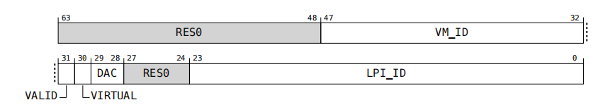

**ITTE 写入（domain_activate 时）**：

```c
// drivers/irqchip/irq-gic-v5-its.c:846 (gicv5_its_map_event)
static int gicv5_its_map_event(struct gicv5_its_dev *its_dev,
                                u32 event_id, u32 lpi)
{
    // 获取 ITTE 指针
    itte = gicv5_its_device_get_itte_ref(its_dev, event_id);

    // 检查是否已被映射
    if (*itte & GICV5_ITS_ITTE_VALID)
        return -EEXIST;

    // 写入 ITTE
    itt_entry = (u64)lpi << GICV5_ITS_ITTE_LPI_SHIFT |
                GICV5_ITS_ITTE_VALID;
    its_write_table_entry(its, itte, itt_entry);

    // 缓存无效化
    gicv5_its_itt_cache_inv(its, its_dev->device_id, event_id);
    return 0;
}
```

#### Step 4：IRS 查 IST 并选候选 HPPI

IRS 收到中断事件后，以 LPI_INTID 索引 IST。注意**所有 IRS 共享同一个 IST**：

IST Entry = IST[LPI_INTID]

查表内容（ARM 官方文档）:
  - Enable bit  → 该 LPI 是否使能？
  - Priority    → 什么优先级？
  - Pending bit → 是否已 pending？

LPI 的 Pending 状态在满足以下条件时更新：
  ① LPI 是 reachable 的（INTID 在 IST 范围内）
  ② 发生以下任意事件：
     a. ITS 生成指定该 INTID 的中断事件
     b. 写 IRS_SETLPI 寄存器指定该 INTID
     c. IRS 处理 GIC 系统指令（如 CDPEND）产生的中断效果

IRS 选择候选 HPPI 的条件（四个条件必须全部满足）:
  - Enabled = 1
  - Pending = 1
  - Active = 0（Inactive）
  - Routing mode = Targeted 且 Affinity 指向该 PE，或 1ofN 且该 PE 被选中

**IST Entry 格式**（单条目，具体编码见规范）：
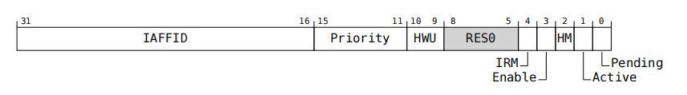

#### Step 5：IRS 路由决策

由IRM域段控制

```
if (Routing == Targeted):
    目标 PE = 查 IAFFID → CPU 映射表
    （per_cpu(cpu_iaffid, cpu).iaffid 由固件提供）

if (Routing == 1ofN):
    从开启了 1ofN 接收的 PE 集合中动态选择一个（IRS_PE_CR0.DPS->是否可接受1ofN中断）

→ IRS 向目标 PE 的 CPU-IF 转发候选 HPPI
  内容: { INTID, Priority, Virtual flag, VM_ID(if virtual) }
```

**路由配置（CDAFF）**：

```c
// 设置 Targeted 路由到指定 PE
cdaff = GICV5_IAFFID(iaffid) |
        GICV5_HWIRQ_SET_TYPE(type) |
        GICV5_HWIRQ_SET_ID(hwirq);
gic_insn(cdaff, CDAFF);
gsb_sys();  // 确保路由更新传播到 IRI
```
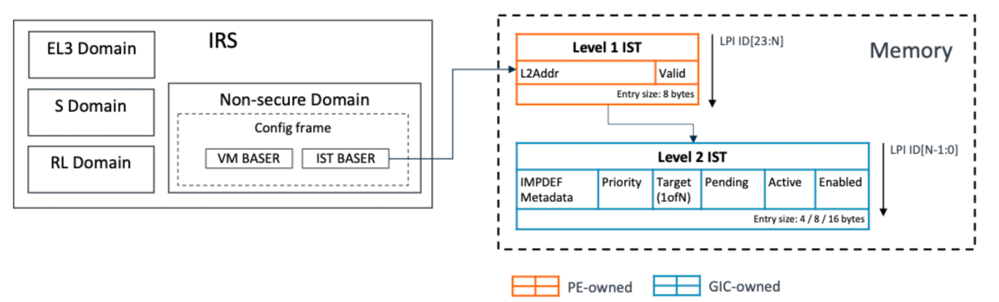

#### Step 6：CPU-IF 最终仲裁

CPU-IF 从 IRS 候选 HPPI 和本地 PPI 中选出最终的 HPPI。注意规范**不保证严格优先级顺序**——中断是异步的，时序和竞争条件可能导致低优先级中断先于高优先级投递。

```
HPPI = max_priority(IRS候选中断, 所有本地Pending PPI)

// Sufficient priority 检查（两个条件都必须满足）：
// ① 优先级的数值 ≤ Priority Mask（GICv5 是 "等于或更高"，非严格更高）
// ② 优先级的数值 < Running Priority（严格更高）
if (HPPI.priority <= ICC_PCR_EL1.PRIORITY      // Priority Mask
    && HPPI.priority < ICC_APR_EL1 最高Active优先级) // Running Priority
{
    if (HPPI.priority == 0x00 && SCTLR_ELx.NMI == 1)
        → 信号 = Superpriority IRQ/FIQ
    else if (HPPI 属于 Current Physical Interrupt Domain)
        → 信号 = IRQ
    else
        → 信号 = FIQ  // EL3 域中断，或跨域抢占
}

每个中断域独立：各自拥有独立的 HPPI、Priority Mask、Active Priorities、Running Priority。
```

#### Step 7：PE 异常处理

PE 收到 IRQ 异常，进入 ARM64 exception vector，最终到达：

```c
// drivers/irqchip/irq-gic-v5.c:944
static void gicv5_handle_irq(struct pt_regs *regs)
{
    u64 ia;
    u32 hwirq;

    // ① 应答 — 执行 CDIA，取出 HPPI
    ia = gicr_insn(CDIA);

    // ② 检查 VALID 位
    if (!FIELD_GET(GICV5_GICR_CDIA_VALID, ia))
        return;  // spurious interrupt

    // ③ GSB_ACK — 确保 CDIA 的激活效果全局可见
    gsb_ack();

    // ④ ISB — CPU 流水线排序
    isb();

    // ⑤ 优先级下降 — 立即降低 Running Priority
    //    (在 handler 之前！这样长 handler 不阻塞同优先级中断)
    gic_insn(0, CDEOI);

    // ⑥ 提取 hwirq，分发
    hwirq = FIELD_GET(GICV5_HWIRQ_INTID, ia);
    handle_irq_per_domain(hwirq);
}
```

**CDIA指令**：

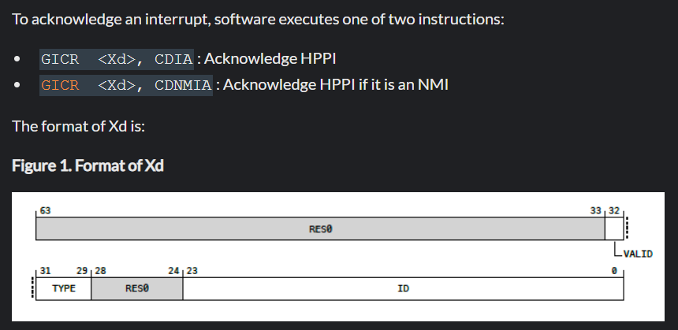

`handle_irq_per_domain` 根据 INTID 的 Type 字段选择 domain：

```c
// drivers/irqchip/irq-gic-v5.c:917
static void handle_irq_per_domain(u32 hwirq)
{
    u32 hwirq_type = FIELD_GET(GICV5_HWIRQ_TYPE, hwirq);
    u32 hwirq_id   = FIELD_GET(GICV5_HWIRQ_ID, hwirq);
    struct irq_domain *domain;

    switch (hwirq_type) {
    case GICV5_HWIRQ_TYPE_PPI:
        domain = gicv5_global_data.ppi_domain;
        break;
    case GICV5_HWIRQ_TYPE_SPI:
        domain = gicv5_global_data.spi_domain;
        break;
    case GICV5_HWIRQ_TYPE_LPI:
        domain = gicv5_global_data.lpi_domain;
        break;
    default:
        return;
    }

    generic_handle_domain_irq(domain, hwirq_id);
    // → 调用 irq_domain 中注册的 handler
    //   PPI: handle_percpu_devid_irq
    //   SPI: handle_fasteoi_irq
    //   LPI: handle_fasteoi_irq
    //   IPI: handle_percpu_irq (hierarchical over LPI)
}
```

**Handler 返回前的去激活**（irq_eoi 回调中）：

```c
// LPI/SPI 的 eoi
static void gicv5_lpi_irq_eoi(struct irq_data *d) {
    gicv5_hwirq_eoi(d->hwirq, GICV5_HWIRQ_TYPE_LPI);
    // → gic_insn(cddi, CDDI)  其中 cddi = TYPE(LPI) | ID(hwirq)
}
```

**完整的 irq_chip 回调（以 LPI 为例）**：

```c
// drivers/irqchip/irq-gic-v5.c
static struct irq_chip gicv5_lpi_irq_chip = {
    .irq_mask       = gicv5_lpi_irq_mask,        // CDDIS + gsb_sys()
    .irq_unmask     = gicv5_lpi_irq_unmask,      // CDEN
    .irq_eoi        = gicv5_lpi_irq_eoi,         // CDDI
    .irq_set_affinity = gicv5_lpi_irq_set_affinity, // CDAFF + gsb_sys()
    .irq_retrigger  = gicv5_lpi_irq_retrigger,   // CDPEND(PENDING=1)
    .irq_set_type   = gicv5_lpi_irq_set_type,    // CDHM
};
```

---

### 2.2 SPI 路径

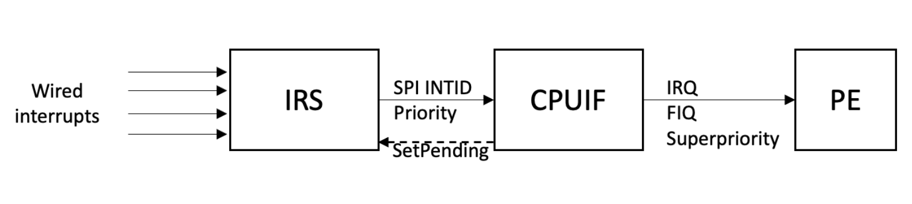

SPI 是有线中断，**始终直连到 IRS**，不需要 IWB 和 ITS。关键特征：

- **INTID 与 wire 固定绑定**：不像 LPI 可以软件控制映射关系，SPI 的 INTID 始终对应特定的输入 wire
- **不需要内存表**：状态存储在 IRS 内部寄存器中，早期启动即可使用
- **跨 IRS 路由**：虽然 SPI 源连接到一个特定 IRS，但**不限制目标 PE**——连到 IRS-A 的 SPI 可以路由到连在 IRS-B 上的 PE

#### 完整流程

```
Step 1: 外部设备拉高/拉低 SPI wire
        → IRS 检测到边沿/电平变化
        → 设 Pending=1（Edge）或根据电平驱动 Pending（Level）

Step 2: IRS 路由
        → 根据 Routing mode（Targeted/1ofN）选目标 PE
        → 转发候选 HPPI 到目标 PE 的 CPU-IF

Step 3: PE 应答后，IRS 标记 Active=1
        → PE 执行 CDDI 后，IRS 清 Active=0
        → 如果此时中断仍 pending（Level 且未 de-assert），可再次投递
```

#### SPI 特殊的配置步骤（通过 IRS MMIO）

SPI 必须先通过 MMIO 分配域和触发类型，之后才用 GIC 系统指令：

```
Step A: 选择 SPI
  写 SPI_INTID 到 IRS_SPI_SELR
  轮询 IRS_SPI_STATUSR.IDLE 直到 1
  检查 IRS_SPI_STATUSR.V == 1（SPI 存在于此 IRS）

Step B: 分配中断域（仅 EL3/Secure 可写）
  写 IRS_SPI_DOMAINR:
    DOMAIN = Non-secure / Secure / Realm / EL3

Step C: 配置触发类型
  写 IRS_SPI_CFGR:
    TRIGGER = Edge / Level

Step D: 之后使用 GIC 系统指令
  GIC CDAFF → 路由
  GIC CDPRI → 优先级
  GIC CDEN  → 使能
```

---

### 2.3 PPI 路径

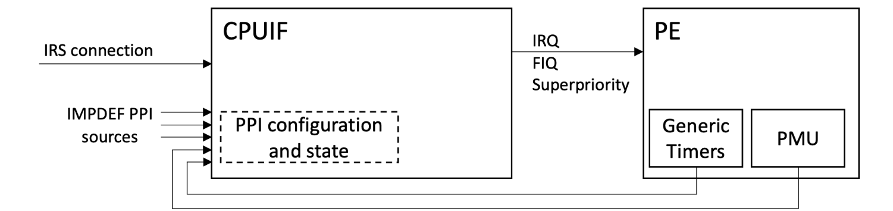

PPI 是 PE 本地事件，**直接在 CPU-IF 内处理，完全不走 IRI（without recourse to the IRI）**。PPI 不需要路由信息——目的地永远是本地 PE。

PPI #0-63 是架构定义的（Generic Timer、PMU 等），#64-127 是实现定义的。架构允许**没有硬件源的 SW_PPI**——只能通过写 `ICC_PPI_SPENDR` 软件置 pending，用于软件间通信。

```
PPI 源（Generic Timer, PMU, 或实现定义源）
  │
  ▼
CPU-IF 内部逻辑:
  → 查 ICC_PPI_ENABLER0/1_EL1：是否 Enabled？
  → 查 pending 状态（硬件驱动 或 软件写 ICC_PPI_SPENDR）
  → 查 active 状态（来自 CDIA/CDDI 副作用）
  → 读 ICC_PPI_PRIORITYR[n]：优先级
  → 读 ICC_PPI_HMR[n]：触发方式（只读，硬件设计固定）

PPI 直接参与 CPU-IF 的 HPPI 选择
  → 与 IRS 转发的候选 HPPI 一起按优先级排序
  → 通过 Priority Mask + Running Priority 检查
  → 拉 IRQ/FIQ
```

CPU interface 在 PE 内部（核心内、CPU die 上），以 FEAT_GCIE 架构特性的形式存在，PPI 操作全部走系统寄存器。

**每个 PE 的 PPI 命名空间独立**：PE0 的 PPI #9（Generic Timer）和 PE1 的 PPI #9 是完全独立的中断。

---

### 2.4 vLPI 路径

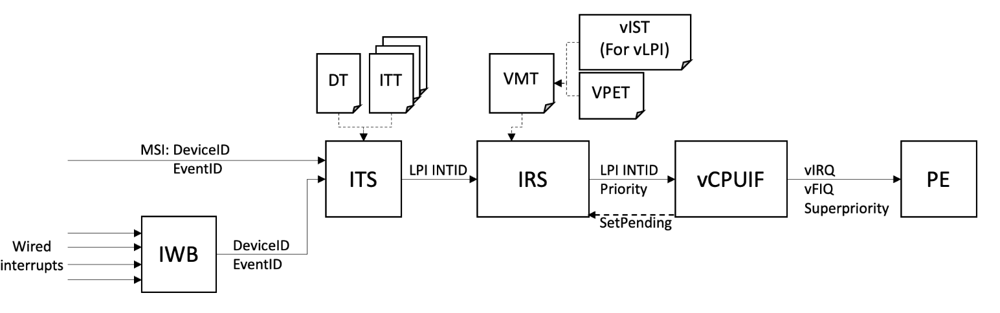

物理 LPI 直接注入到 VM 需要 ITS 翻译出 VIRTUAL=1 的 ITTE。

#### 完整流程

```
Step 1-2: 与物理 LPI 相同（MSI → ITS 翻译）

Step 2b: ITS 查 ITTE 时发现 VIRTUAL=1
  输出: { LPI_INTID, phys/virt, Event, VM_ID, Domain }
  → 发送给 IRS

Step 3: IRS 收到虚拟中断事件
  查 VM Table[VM_ID]
    → L2_VMTE.VALID ？
    → L2_VMTE.LPI_IST_ADDR → Virtual LPI IST

Step 4: IRS 查 Virtual LPI IST
  Virtual IST[LPI_INTID]:
    → Enabled？Pending？Priority？Routing（Targeted/1ofN）？
    → 路由目标 = VPE_ID（不是物理 IAFFID！）

Step 5a: VPE 在线（resident）
  查 VPE Table[VPE_ID] → VPETE
  → vPE 当前在哪个 PE 上（通过 VPE Descriptor）

Step 5b: VPE 不在线
  门铃条件（全部满足才触发，规范 §4.10.7 RCWZMW）:
    ① VPE 不在任何 PE 上（本分支已满足）
    ② 门铃设置有效（创建后经 IRS_VPE_SELR 写过 IRS_VPE_DBR）
    ③ 请求过门铃（ICH_CONTEXTR_EL2.DB 或 IRS_VPE_DBR.REQ_DB=1）
    ④ 有 Targeted 虚拟中断 Pending+Inactive+Enabled
       （或 1ofN 门铃条件满足）
    ⑤ 该中断优先级 ≥ DBPM 阈值 ★
       （重要性比较；数值上 ≤ DBPM —— GIC 数值越小优先级越高。
         DBPM 由 Hypervisor 按 Guest 的 Running Priority 与
         Priority Mask 计算，低于阈值的低优先级中断不唤醒 VPE）
  if (门铃条件全部满足):
    → 对 Doorbell LPI（普通物理 LPI）生成 SET_EDGE 事件
    → 走普通物理 LPI 投递（自身 affinity 路由到 Hypervisor）
    → REQ_DB 硬件自动清零 —— 每个 non-resident 周期只响一次
  else:
    → 中断保持 pending，等待 VPE 变为 resident
```

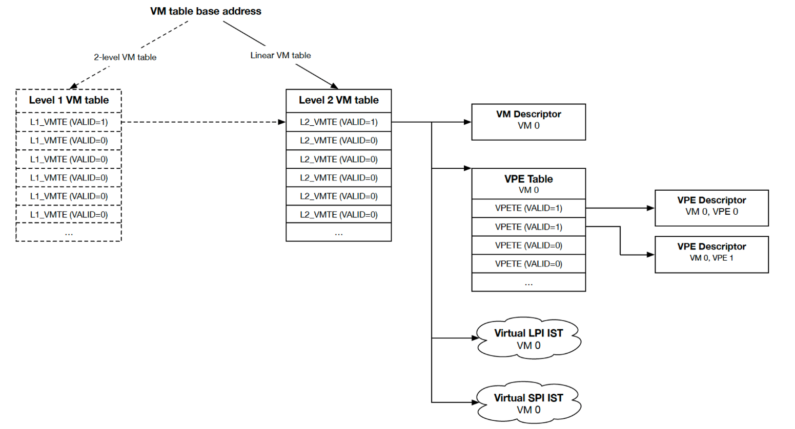

**Doorbell 机制**：
- 每个 VPE 分配一个物理 LPI 作为 doorbell 中断
- VPE 不在线 + 有虚拟中断 pending → IRS 置 doorbell LPI pending（仅触发一次）
- DBPM（Doorbell Priority Mask）：低优先级虚拟中断不触发 doorbell，避免不必要的 VPE 调度

---

### 2.5 vSPI 路径

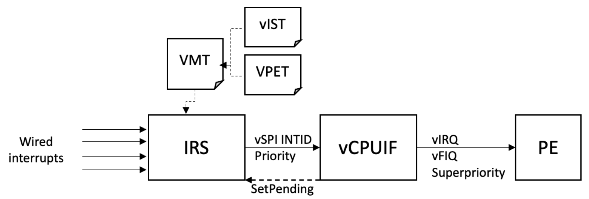

vSPI 有两条路线：

**路线 A：物理 SPI 直接映射（IRS_SPI_VMR）**

```
Step 1: Hypervisor 配置映射
  选择物理 SPI → IRS_SPI_SELR
  写 IRS_SPI_VMR: VIRT=1, VM_ID=目标VM
  轮询 IRS_SPI_STATUSR.IDLE

Step 2: 物理 SPI asserted
  → IRS 发现 IRS_SPI_VMR.VIRT=1
  → 不参与物理 HPPI（物理 SPI unreachable）
  → 直接在 Virtual SPI IST 中标记对应 vSPI pending

Step 3: IRS 查 Virtual SPI IST
  → Routing → VPE_ID
  → 同 vLPI 的 Step 5a/5b
```

**路线 B：Hypervisor 软件注入（GIC VDPEND）**

```
Hypervisor 执行:
  GIC VDPEND, Xt    // Xt 包含 VM_ID + vSPI INTID + PENDING=1

→ IRS 在指定 VM 的 Virtual SPI IST 中置 Pending
→ 路由到目标 VPE
```

---

### 2.6 vPPI 路径

vPPI 的直通机制是 DVI（Direct Virtual Injection）：每个物理 PPI 有同号的 vPPI（同 PE），DVI=1 时物理 PPI 的 pending 被硬件实时镜像到 vPPI pending：

```
物理 PPI #27 (Timer) pending
  └→ ICH_PPI_DVIR0_EL2.bit27 == 1 ？
       YES → vPPI #27 pending 同步镜像
             Guest 在 Virtual Domain 直接处理，零 Hypervisor 介入
```

要点：

- DVI 只镜像 **pending 一位**：enable/priority/active 各归各，Guest 用自己的 `ICV_PPI_*` 配置虚拟侧；两侧是独立中断、各自应答，Hypervisor 约定禁用物理侧（`ICC_PPI_ENABLER` 清位 + ISB）
- vPPI 状态存 PE 虚拟寄存器（Guest 视角 `ICV_PPI_*_EL1` / Hypervisor 视角 `ICH_PPI_*_EL2`），**每进出 Guest 保存/恢复**（switch.c:117/132）
- DVI 是**边界动态开关**：进入时全量写位图开 DVI，退出时读回状态后立即清零（不剪断直连线，物理 PPI 会误打到下一个 VPE 上下文）

```c
// 进入 Guest (hyp/vgic-v5-sr.c:61-67)
write_sysreg_s(bitmap_read(dvir, 0, 64), SYS_ICH_PPI_DVIR0_EL2); // 开 DVI
bitmap_andnot(pendr, pendr, dvir, 64);   // pending 只恢复非 DVI 位——
write_sysreg_s(pendr, SYS_ICH_PPI_PENDR0_EL2); // DVI 位由硬件实时驱动

// 退出 Guest (hyp/vgic-v5-sr.c:52)
write_sysreg_s(0, SYS_ICH_PPI_DVIR0_EL2);       // 立即关 DVI
```

非 DVI 的 vPPI（SW_PPI、模拟源）走软件注入：置 `pending_latch` → queue 函数只 kick 不写寄存器（Guest 运行期寄存器归 Guest）→ 下次进入前 flush 汇总影子、restore 时写入 `ICH_PPI_PENDR`。

Timer PPI 是 level 触发，pending 由源端电平驱动——Guest 重新编程 Timer 后电平撤销，物理/虚拟 pending 自然清除，无需 GIC 侧 ack/deactivate。泳道图：

```
            Guest                 Timer               GIC (PPI #27)        Hypervisor
            ─────                 ─────               ─────────────        ──────────
               │                      │                      │       phys PPI #27
               │                      │                      │       disabled (setup)
               │                      │  CNTV == CVAL        │            │
               │                      │  wire asserted       │            │
               │                      │──────────────────────►│            │
               │                      │                      │  phys pending = 1
               │                      │                      │        │
               │                      │                      │  virt pending = 1
               │                      │                      │        ▼
               │  vIRQ delivered      │                      │
               │◄─────────────────────│                      │
  handler runs │                      │                      │
               │  GICR CDIA (ack)     │                      │
               │──────────────────────┼──────────────────────►│  Active = 1
               │                      │                      │  pending unchanged
               │  read CNTV_CTL_EL0   │                      │
               │─────────────────────►│                      │
               │  write CNTV_CVAL_EL0 │                      │
               │─────────────────────►│  wire deasserted     │
               │                      │──────────────────────►│
               │                      │                      │  phys pending = 0
               │                      │                      │  (level-driven)
               │                      │                      │        │
               │                      │                      │  virt pending = 0
               │  GIC CDDI (deact)    │                      │
               │──────────────────────┼──────────────────────►│  Active = 0
               │  ERET                │                      │
               │                      │                      │
```

---

### 2.7 路由路径汇总

```
                    ┌──────────────────────────────────────────────┐
                    │              CPU Interface                    │
                    │  ┌─────────┐  ┌──────────┐  ┌────────────┐  │
   PPI ────────────→│  │PPI 状态  │  │Virtual PPI│  │Virtual     │  │
                    │  │(ICC_PPI_ │  │(ICV_PPI_* │  │CPU-IF      │  │
                    │  │ *_EL1)   │  │ _EL1)     │  │(ICV_*_EL1) │  │
                    │  └─────────┘  └──────────┘  └────────────┘  │
                    │        │            │              │         │
                    │        ▼            ▼              ▼         │
                    │  ┌──────────────────────────────────────┐   │
                    │  │         HPPI 选择 & 优先级仲裁        │   │
                    │  └──────────────────────────────────────┘   │
                    └────────────────────────────────────────────┘
                                     ↑
                                     │ 候选 HPPI (物理) + 候选 vHPPI (虚拟)
                                     │
                    ┌────────────────┴────────────────────────┐
                    │              IRS                         │
                    │  ┌──────────┐ ┌───────────┐ ┌─────────┐ │
                    │  │物理 IST   │ │Virtual LPI│ │Virtual  │ │
                    │  │(LPI状态)  │ │IST (per VM)│ │SPI IST  │ │
                    │  ├──────────┤ ├───────────┤ │(per VM) │ │
                    │  │SPI 寄存器 │ │           │ │         │ │
                    │  └──────────┘ └───────────┘ └─────────┘ │
                    └────────────────┬────────────────────────┘
                                     ↑
                      ┌──────────────┴──────────────┐
                      │            ITS               │
                      │  DT → ITT 翻译               │
                      │  (DeviceID,EventID)→LPI ID   │
                      └──────────┬──────────────────┘
                                 ↑
                      ┌──────────┴──────────┐
                      │        IWB          │      MSI 写事务 (PCIe)
                      │  有线信号→ITS事件     │
                      └─────────────────────┘
```

---

## 三、软件配置与实现

### 3.1 内核驱动文件结构

```
drivers/irqchip/
├── irq-gic-v5.c        (~1268行) 顶层: irq_chip + 异常入口 + IPI + CPU初始化
├── irq-gic-v5-irs.c    (~969行)  IRS: IST管理 + SPI配置 + IAFFID映射
├── irq-gic-v5-its.c    (~1344行) ITS: DT/ITT管理 + MSI domain
├── irq-gic-v5-iwb.c    (~299行)  IWB: 有线使能 + 触发类型 + FIXED_MSG_DATA
include/linux/irqchip/
└── arm-gic-v5.h        (~431行)  寄存器/指令编码 + 共享结构体
```

**IRQ Domain 层级**：

```
PPI Domain (linear, 0..127)
  handle_percpu_devid_irq

SPI Domain (linear, spi_min..spi_min+range)
  handle_fasteoi_irq

LPI Domain (tree, IDA 动态分配)
  handle_fasteoi_irq
  ├── IPI Domain (hierarchical, parent=LPI)
  │     handle_percpu_irq
  │     GICV5_IPIS_PER_CPU = MAX_IPI 个向量 per CPU
  └── ITS MSI Domain (parent=LPI)
        ├── gicv5_its_msi_prepare()
        ├── gicv5_its_irq_domain_alloc()
        ├── gicv5_its_irq_domain_activate()
        └── gicv5_its_irq_domain_free()
              └── IWB Wired-to-MSI Domain
                    MSI_ALLOC_FLAGS_FIXED_MSG_DATA
```

---

### 3.2 初始化流程

#### 3.2.1 系统初始化顺序

```
① 平台固件(Firmware)  → ② IRI 链路建立  → ③ IST 配置  → ④ ITS 配置
→ ⑤ SPI 配置  → ⑥ PPI 配置  → ⑦ IPI 配置  → ⑧ 设备中断注册
```

#### 3.2.2 IRI 链路建立

每个 PE 需要建立与 IRS 的通信链路。ARM 建议如果存在 EL3，在离开 EL3 之前完成链路建立。复位后的初始状态取决于实现选择：`ICC_CR0_ELx.LINK` 复位值可以是 1（已连接）或 0（未连接）。

```
Step 1: 检查当前链路状态
  if (ICC_CR0_ELx.LINK == 1)
      → 已连接，无需操作

Step 2: 请求建立链路
  write ICC_CR0_ELx.LINK = 1  // 请求连接 CPU-IF 和 IRI

Step 3: 等待链路完成
  do { poll ICC_CR0_ELx.LINK_IDLE } while (!IDLE)
  // 链路在 LINK_IDLE=1 之前未完全连接

Step 4: 上下文同步
  ISB  // 保证后续 GIC 系统寄存器写和 GIC 系统指令看到 LINK=1 的效果
```

如果 EL3 存在，链路由 `ICC_CR0_EL3.{LINK, LINK_IDLE}` 控制，`ICC_CR0_EL1` 的对应字段是只读别名。否则由 `ICC_CR0_EL1` 控制。

一些平台在 IRS 链路上线前需要系统特定的初始化步骤，引导软件必须确保在尝试连接 IRI 链路前完成这些初始化。

#### 3.2.3 IAFFID 发现

```
自发现方法:
  IAFFID = read ICC_IAFFIDR_EL1

  对每个候选 IRS:
    写 IAFFID 到 IRS_PE_SELR
    轮询 IRS_PE_STATUSR.IDLE
    if (IRS_PE_STATUSR.V == 1):
      该 PE 连接到此 IRS

生产环境:
  由固件 (DT/ACPI) 直接报告映射关系
  DT:  of_property_read_u16_array("arm,iaffids")
  ACPI: acpi_madt_generic_interrupt.iaffid
```

#### 3.2.4 IST 配置

```c
// 1. 确定 LPI_ID_BITS
//    读 IRS_IDR2.MAX_LPI_ID_BITS → 硬件上限
//    读 IRS_IDR2.MIN_LPI_ID_BITS → 硬件下限
//    软件在 [MIN, MAX] 范围内选择

// 2. 分配 IST 内存
size_t ist_size = calculate_ist_size(lpi_id_bits, istsz, l2sz, linear_or_2level);
void *ist = kzalloc(ist_size, GFP_KERNEL);

// 3. 初始化 IST 条目（全零 = disabled）

// 4. 配置 IRS_IST_CFGR
write IRS_IST_CFGR:
  LPI_ID_BITS = N
  ISTSZ       = entry_size_granularity
  STRUCTURE   = Linear / 2-level
  L2SZ        = split_size (if 2-level)

// 5. 配置基地址并启用
write IRS_IST_BASER:
  ADDR  = virt_to_phys(ist)
  VALID = 1

// 6. 等待就绪
poll IRS_IST_STATUSR.IDLE until 1

// ⚠️ 此后软件不能再直接访问 IST！
```

#### 3.2.5 ITS 配置

ARM 官方文档定义了 6 步 ITS 配置流程：

```
Step 1: 分配 ITS 翻译结构
  - 分配 DT（每 ITS 一个），以 DeviceID 索引
  - 分配 ITT（每设备一个），以 EventID 索引
  - DTE 包含：ITT 物理地址、EventID bits、ITT 结构

Step 2: 编程 ITS 寄存器
  - ITS_DT_BASER: DT 物理基地址
  - ITS_DT_CFGR: DT 大小、DeviceID bits、结构（Linear/2-level）
  - ITS_CR1: Shareability 和 Cacheability 属性
  - ITS_CR0.ITSEN = 1; poll ITS_CR0.IDLE until 1
  - 此时 ITS 活跃但无有效映射（可提供全 invalid 的 DT）

Step 3: 填充 DTE 和 ITTE
  - DTE: 为每设备指定 ITT 基地址、EventID bits 数、ITT 结构
  - ITTE: 为每个 EventID 映射到 LPI INTID

Step 4: ITS 缓存无效化
  - 修改 DTE → 写 ITS_INV_DEVICER
  - 修改 ITTE → 写 ITS_INV_EVENTR
  - ⚠️ ITS 可缓存 VALID=0 的条目！即使之前无效也需写无效化寄存器
  - 轮询 ITS_STATUSR.IDLE

Step 5 (可选): 软件生成 ITS 事件测试
  - 写 ITS_GEN_EVENT_DIDR (DeviceID)
  - 写 ITS_GEN_EVENT_EIDR (EventID)
  - 设置 ITS_GEN_EVENTR.TARGET_DOMAIN + R=1
  - 轮询 ITS_GEN_EVENT_STATUSR.IDLE

Step 6: ITS 同步
  - 写 ITS_SYNCR.SYNC = 1（SYNCALL=1 可同步整个 ITS 域）
  - 轮询 ITS_SYNC_STATUSR.IDLE
  - 此时所有已同步事件保证已被翻译且被关联 IRS 接受
```

#### 3.2.6 CPU 上线初始化

每个 CPU 上线时执行：

```c
// drivers/irqchip/irq-gic-v5.c:1006
void gicv5_starting_cpu(int cpu)
{
    // 检查 FEAT_GCIE 特性
    WARN(!gicv5_cpuif_has_gcie(), "CPU does not support GICv5 CPU interface\n");

    // 清零所有 PPI 使能
    write_sysreg_s(0, SYS_ICC_PPI_ENABLER0_EL1);
    write_sysreg_s(0, SYS_ICC_PPI_ENABLER1_EL1);

    // 初始化 PPI 优先级为最低
    gicv5_ppi_priority_init();  // 全部写入 GICV5_IRQ_PRI_MI

    // 设置 Priority Mask
    write_sysreg_s(GICV5_IRQ_PRI_MI, SYS_ICC_PCR_EL1);

    // 全局使能中断：ICC_CR0_EL1.EN = 1
    sysreg_clear_set_s(SYS_ICC_CR0_EL1, 0, GICV5_ICC_CR0_EN);

    // 向 IRS 注册该 CPU
    gicv5_irs_register_cpu(cpu);
    // → 查 IAFFID
    // → IRS_PE_SELR 选择 PE
    // → IRS_PE_CR0.DPS = 1 (启用 Doorbell to PE)
}
```

---

### 3.3 LPI 配置完整调用栈

以 PCIe 设备申请 MSI 中断为例：

```
pci_alloc_irq_vectors(dev, 1, 16, PCI_IRQ_MSI)
  │
  └→ pci_alloc_irq_vectors_affinity()
       └→ __pci_enable_msi_range()
            └→ msi_domain_alloc_irqs()
                 │
                 ├→ gicv5_its_msi_prepare()     // ① 设备注册
                 │     └→ gicv5_its_alloc_device(its, nvec, dev_id)
                 │           ├→ kzalloc(its_dev)
                 │           ├→ gicv5_its_device_register(its, its_dev)
                 │           │     ├→ gicv5_its_devtab_get_dte_ref()
                 │           │     │     获取/分配 DTE
                 │           │     ├→ 决定 ITT 布局 (线性/二级)
                 │           │     └→ 分配并初始化 ITT
                 │           ├→ bitmap_zalloc(event_map)
                 │           └→ xa_store(&its->its_devices, dev_id, its_dev)
                 │
                 ├→ gicv5_its_irq_domain_alloc() // ② 分配 IRQ
                 │     ├→ gicv5_its_alloc_eventid()
                 │     │     └→ bitmap_find_free_region(event_map)
                 │     ├→ irq_domain_alloc_irqs_parent()
                 │     │     └→ gicv5_irq_lpi_domain_alloc()
                 │     │           ├→ ida_alloc_max() 分配 LPI INTID
                 │     │           └→ gicv5_irs_iste_alloc() 分配 IST entry
                 │     └→ irq_domain_set_info() 设置 irq_chip + handler
                 │
                 └→ gicv5_its_irq_domain_activate() // ③ 激活映射
                       └→ gicv5_its_map_event(its_dev, event_id, lpi)
                             ├→ gicv5_its_device_get_itte_ref()
                             ├→ its_write_table_entry(ITTE = LPI_ID | VALID)
                             └→ gicv5_its_itt_cache_inv()
```

**MSI 消息构造**（在激活后，设备驱动写 MSI table 时）：

```c
// 设备驱动调用 pci_write_msi_msg → 最终到
gicv5_its_compose_msi_msg(d, msg):
  msg->address_lo/hi = its_trans_phys_base  // ITS 翻译寄存器物理地址
  msg->data          = EventID               // 由 bitmap 分配的事件号
```

---

### 3.4 SPI 配置调用栈

```
// SPI 只在使用前配置一次（通常是固件或启动代码）

// 1. 选择 SPI
writel_relaxed(spi_intid, irs_base + IRS_SPI_SELR);
do { val = readl_relaxed(irs_base + IRS_SPI_STATUSR);
} while (!(val & IRS_SPI_STATUSR_IDLE));
if (!(val & IRS_SPI_STATUSR_V)) { /* SPI 不在此 IRS */ }

// 2. 分配域 (EL3/Secure only)
writel_relaxed(DOMAIN_NONSECURE, irs_base + IRS_SPI_DOMAINR);
do { poll IRS_SPI_STATUSR.IDLE } while (!IDLE);

// 3. 配置触发类型
writel_relaxed(SPI_CFGR_EDGE, irs_base + IRS_SPI_CFGR);
do { poll IRS_SPI_STATUSR.IDLE } while (!IDLE);

// 4. GIC 系统指令配置优先级、路由、使能
gic_insn(CDPRI_ARG(spi_intid, priority), CDPRI);
gic_insn(CDAFF_ARG(spi_intid, iaffid), CDAFF);
gsb_sys();
gic_insn(CDEN_ARG(spi_intid), CDEN);
```

---

### 3.5 PPI 配置调用栈

```
// PPI 通过 request_irq 注册，走通用中断子系统
request_irq(ppi_irq, handler, flags, name, dev)
  │
  └→ request_threaded_irq()
       └→ __setup_irq()
            └→ irq_startup()
                 └→ gicv5_ppi_irq_unmask()
                       └→ sysreg_clear_set_s(SYS_ICC_PPI_ENABLER0_EL1, 0, BIT)
                           isb()
```

**PPI 域分配（EL3 固件负责）**：

```c
// 例如：将 Generic Timer PPI (PPI #27) 分配给 Non-secure 域
write_sysreg_s(ICC_PPI_DOMAINR0_EL3, bitmask_assigning_PPIs_to_domains);
```

---

### 3.6 IPI 配置与发送

```c
// IPI domain 初始化 (irq-gic-v5.c:1020)
// 为每个 CPU 分配 GICV5_IPIS_PER_CPU 个 LPI 作为 IPI
set_smp_ipi_range_percpu(GICV5_IPIS_PER_CPU, ...);

// IPI 发送 (irq-gic-v5.c:487)
static void gicv5_ipi_send_single(struct irq_data *d, unsigned int cpu)
{
    // IPI 就是向目标 CPU 标记一个 LPI pending
    irq_chip_retrigger_hierarchy(d);
    // → gicv5_lpi_irq_retrigger(d)
    //   → irq_chip_set_irqchip_state(d, IRQCHIP_STATE_PENDING, true)
    //     → gic_insn(CDPEND_ARG(lpi_intid, PENDING=1), CDPEND)
}
```

---

### 3.7 中断处理完整热路径

```
ARM64 Exception (VBAR_EL1 + IRQ)
  │
  └→ gicv5_handle_irq()                          // irq-gic-v5.c:944
       ├→ gicr_insn(CDIA)                        // 应答
       ├→ GSB_ACK                                // GIC 同步
       ├→ ISB                                    // CPU 同步
       ├→ gic_insn(0, CDEOI)                    // 优先级下降
       └→ handle_irq_per_domain(hwirq)           // :917
            └→ generic_handle_domain_irq(domain, hwirq_id)
                 └→ generic_handle_irq_desc()
                      └→ desc->handle_irq()
                           │
                           ├─ LPI/SPI: handle_fasteoi_irq()
                           │     └→ handle_irq_event()
                           │          └→ driver_handler()
                           │          └→ desc->irq_data.chip->irq_eoi()
                           │               = gicv5_lpi_irq_eoi()
                           │                 → gic_insn(CDDI_ARG, CDDI)
                           │
                           ├─ PPI: handle_percpu_devid_irq()
                           │     └→ driver_handler()
                           │     └→ gicv5_ppi_irq_eoi()
                           │          → gic_insn(CDDI_ARG, CDDI)
                           │
                           └─ IPI: handle_percpu_irq()
                                 └→ ipi_handler()
```

**五个同步点的时序图**：

```
时间 →

CDIA   GSB_ACK  ISB   CDEOI      Handler           CDDI   ERET
 │        │      │      │           │                │      │
 │ 应答   │ GIC  │CPU   │ 优先级     │ 驱动处理        │ 去激活│
 │ 中断   │ 同步  │排序   │ 下降      │ 设备            │ 中断  │
 │        │      │      │           │                │      │
 ▼        ▼      ▼      ▼           ▼                ▼      ▼
Active=1  确保   防止   降低Running  同优先级中断       Active=0
Pend=0   可见   推测    Priority    已可响应          可再次
RunPri↑  性     执行                 本中断           响应
```

---

### 3.8 虚拟化软件流程

#### 3.8.1 VM 创建

```c
// Hypervisor 创建 VM 的 GIC 虚拟化上下文：

// 1. 分配 Virtual LPI IST 和 Virtual SPI IST
vlpi_ist = kzalloc(vlpi_ist_size, GFP_KERNEL);
vspi_ist = kzalloc(vspi_ist_size, GFP_KERNEL);

// 2. 分配 VPE Table
vpe_table = kzalloc(vpe_table_size, GFP_KERNEL);

// 3. 分配 VM Descriptor (if IRS_IDR3.VMD == 1)
vm_desc = kzalloc(vm_desc_size, GFP_KERNEL);

// 4. 设置 L2_VMTE (通过 IRS_VMAP_VISTR 等寄存器)
//    L2_VMTE.LPI_IST_ADDR   = virt_to_phys(vlpi_ist)
//    L2_VMTE.SPI_IST_ADDR   = virt_to_phys(vspi_ist)
//    L2_VMTE.VPE_TABLE_ADDR = virt_to_phys(vpe_table)
//    L2_VMTE.VM_DESC_ADDR   = virt_to_phys(vm_desc) (if needed)

// 5. 写 IRS_VMAP_VISTR 使 Virtual LPI IST 生效
//    轮询 IRS_VMT_STATUSR.IDLE

// 6. 写 IRS_VMAP_VPER 注册 VPE
```

#### 3.8.2 VPE 创建与驻留

```c
// 为每个 vCPU 分配 VPE Descriptor
vpe_desc = kzalloc(IRS_IDR4.VPED_SZ, GFP_KERNEL);

// 配置 VPETE → 指向 VPE Descriptor
// (通过 IRS_VMAP_VPER 寄存器)

// 分配 Doorbell LPI
doorbell_lpi = allocate_lpi();
// 配置 doorbell LPI 路由到处理 VPE 调度的物理 CPU

// 使 VPE resident:
ICH_CONTEXTR_EL2_val =
    ICH_CONTEXTR_V(1) |
    ICH_CONTEXTR_VM(vm_id) |
    ICH_CONTEXTR_VPE(vpe_id);
write_sysreg(ICH_CONTEXTR_EL2_val, ICH_CONTEXTR_EL2);
isb();
```

#### 3.8.3 Virtual CPU Interface 使能

```c
// Hypervisor 使能虚拟 CPU 接口
write_sysreg_s(ICH_VCTLR_EL2_V3(0) |  // GICv5 模式 (非 legacy)
               ICH_VCTLR_EL2_EN(1),    // 启用 VCPU 接口
               SYS_ICH_VCTLR_EL2);
isb();

// Guest 现在看到的是 Virtual Domain
// 所有 ICC_* 寄存器名实际访问 ICV_* 寄存器
// GIC 系统指令操作 Virtual Domain
```

---

### 3.9 主线合入状态

#### 已合入 ✅

| # | 系列 | 合入时间 | 补丁数 | 内容 |
|---|------|---------|--------|------|
| ① | Host Driver v7 | 2025.07 | 31 | 完整物理驱动栈：PPI/SPI/LPI/ITS/IWB |
| ② | Post-merge Fixes | 2025.09 | ~10 | 失败路径、kmemleak、WARN_ON 等修复 |
| ③ | ACPI Boot v3 | 2026.01 | 6 | MADT/IORT ACPI 探测 |
| ④ | vGICv5 PPI v7 | 2026.03 | 41 | KVM vPPI + DVI + arch timer + PMU |
| ⑤ | VGICv5 Fixes v2 | 2026.04 | 16 | config_lock 竞争、edge pending、优先掩码 |
| ⑥ | LPI Range Alloc | 2026.05 | 3 | LPI 范围分配/释放、ITS parent 合并请求 |
| ⑦ | Cleanups + Prio Drop | 2026.05 | 8 | PPI 迭代器、CDEOI 优化、constify |

**当前主线总提交**：42 个 irq-gic-v5 + 28 个 vgic-v5

#### 开发中 ❌（补丁已发但未合入）

| # | 系列 | 最后版本 | 补丁数 | 状态 |
|---|------|---------|--------|------|
| ⑧ | KVM IRS support | v4 (2026.07) | 48 | SPI/LPI KVM 虚拟化，含 VM/VPE 表、IST 迁移、selftest |
| ⑨ | IWB ACPI probe deferral | v4 (2026.07) | 7 | 解决 IWB platform device 探测时序晚于消费驱动的问题 |

#### 尚未实现

- **电源管理**（suspend/resume）
- **kexec/kdump 支持**
- **KVM ITS 虚拟化**（vITS）
- **SW Error Reporting 驱动支持**：IRS 和 ITS 硬件已支持通过 `*_SWERR_STATUSR` + syndrome 寄存器上报软件编程错误（非法域分配、无效 INTID、表访问失败等），规范已定义但内核驱动尚未利用
- **GICv5 示例代码**（ARM 承诺后续在 GitHub 发布）

#### 硬件能力提醒

规范定义了但内核尚未充分利用的硬件机制：

- **IRS/ITS 软件错误报告**：`IRS_IDR0.SWE` / `ITS_IDR0.SWE` 报告是否支持，`*_SWERR_STATUSR` + `*_SWERR_SYNDROMER0/1` 提供详细错误上下文（含 INTID、中断类型、故障数据结构地址、时间戳）。ITS 错误清除有明确的 W1C + 原子性要求
- **ITS_GEN_EVENTR**：软件可生成测试 ITS 事件验证翻译配置，无需物理设备
- **IRS_SETLPI**：直接通过 MMIO 置 LPI pending，不走 ITS

---

*笔记时间：2026-08-05*
*内核版本：master (fc46aed51f6)*
*规范版本：Arm GICv5 beta2 (ARM-AES-0070 00bet2, 2025/Aug/15)*
