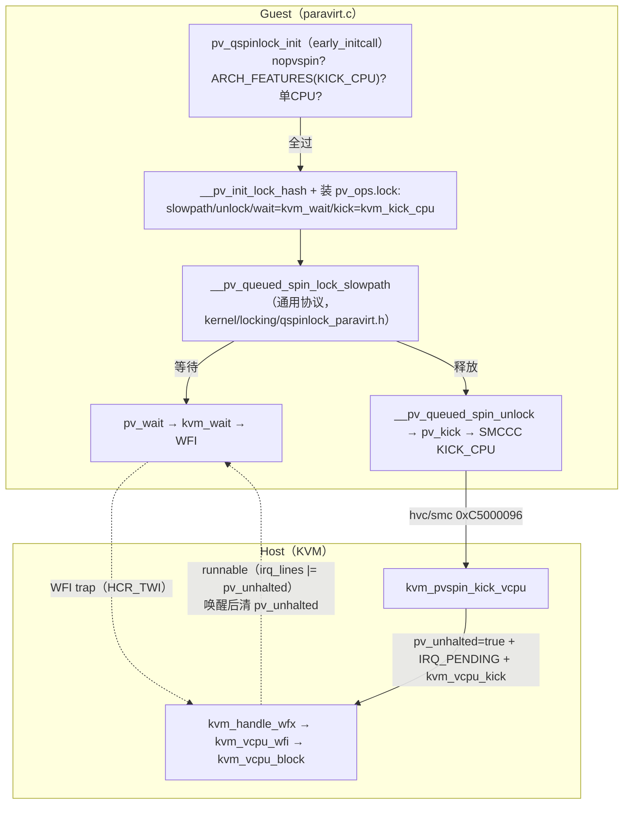
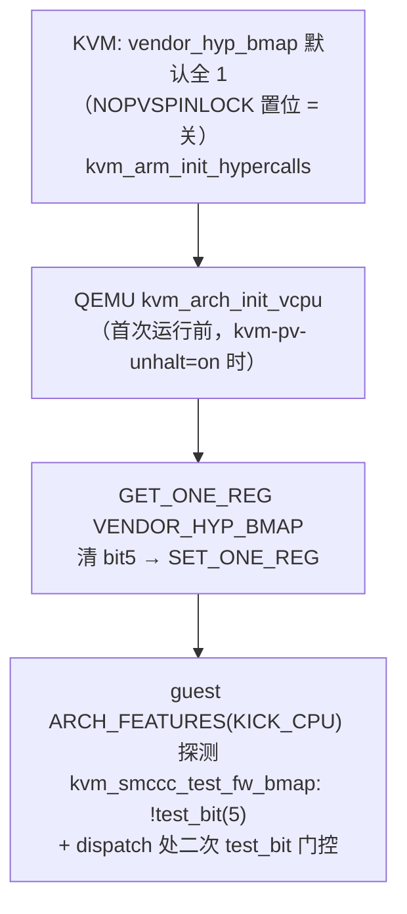

# arm64 PV qspinlock（KVM backend）笔记

> 适用：openEuler OLK-6.6（`/home/code/kernel`）+ QEMU 8.2.0（`/home/code/qemu`）
> 提交：kernel 90578355ce6e → a91bb63002fa → 2a9dd5ab500e → 5a96155e1327 → 433ccd5cd753 → 9b3532c67895 → cd64a7e8af7d → b0d25fc37095（bugzilla 9757）；qemu 6640df81ef（bugzilla 281）
> 一句话：把通用的 PV qspinlock 协议（halt/kick + hash）接到 arm64 —— **wait = WFI 陷入宿主睡眠，kick = SMCCC VENDOR_KICK_CPU 超调用唤醒**。此前 arm64 没有 PV qspinlock（无 `CONFIG_PARAVIRT_SPINLOCKS`，靠 CNA + pvsched preempted 缓解），本系列补上了 KVM backend。

---

## 1. 背景 / 解决的问题

qspinlock 慢路径等待者空转（arm64 的 WFE 只降功耗），**感知不到持有者被抢占或长时间阻塞**：lock holder preemption 下等待者白烧 CPU，宿主上其他 vCPU 饿死。

- x86 答案：PV halt/kick 协议（`qspinlock_paravirt.h` 通用实现，`pv_wait`→halt，`pv_kick`→KVM_HC_KICK_CPU）。
- arm64 上游从未合入该协议；openEuler 此前靠 CNA + pvsched preempted 标志缓解。
- 本特性：**复用通用 `kernel/locking/qspinlock_paravirt.h` 协议**，仅替换底层两个原语：
  - `pv_wait` = `kvm_wait`：锁值未变 → `dsb(sy); wfi()` 陷入 EL2 睡眠（不烧 CPU，宿主可调度别的任务）；
  - `pv_kick` = `kvm_kick_cpu`：`ARM_SMCCC_VENDOR_KICK_CPU` 超调用（0xC5000096，FAST SMC64 VENDOR_HYP 段），宿主唤醒目标 vCPU 立即重查锁。



- 与 CNA 互斥：`asm/qspinlock.h:47` —— `NUMA_AWARE_SPINLOCKS && !PARAVIRT_SPINLOCKS` 才走 CNA；PV 开启时慢路径直接走 PV 协议。
- pvsched（preempted 标志）与本特性并存：pvsched 救 mutex/rwsem 的 osq 自旋，PV qspinlock 救 spinlock 慢路径。

## 2. 通用 PV 协议关键点（arm64 直接复用）

- 状态机：`vcpu_running → vcpu_halted（pv_wait_node）→ vcpu_hashed（hash + 睡眠）`。
- hash 表：`__pv_init_lock_hash()`，size = `4 * num_possible_cpus()`（最小 `PV_HE_MIN`），按 `(lock, cpu)` 键查找阻塞节点。
- `pv_kick_node`（锁交接免唤醒）：owner 直接 `cmpxchg(state, halted→hashed)` 并代写 hash + `_Q_SLOW_VAL`，waiter 醒来直接进 `pv_wait_head_or_lock`，省一次 wake/sleep。
- 队头 `pv_wait_head_or_lock`：先自旋 `SPIN_THRESHOLD` 次（失败才 WFI），然后 `pv_hash` + `xchg(locked, _Q_SLOW_VAL)` + `pv_wait(&lock->locked, _Q_SLOW_VAL)`。
- unlock：`cmpxchg_release(locked, 1→0)` 成功即返（无等待者快路径）；值为 `_Q_SLOW_VAL` → 慢路径 `pv_unhash` + `store_release(0)` + `pv_kick(node->cpu)`。

## 3. 调用栈

### 3.1 guest 加锁（等待侧）

```
queued_spin_lock()
└─ queued_spin_lock_slowpath → pv_queued_spin_lock_slowpath（asm/qspinlock.h:32-35）
   └─ __pv_queued_spin_lock_slowpath                     kernel/locking/qspinlock_paravirt.h
      ├─ 排队后等前驱: pv_wait_node → pv_wait_early → pv_wait(&pn->state, vcpu_halted)
      │   └─ kvm_wait(ptr,val)                           arch/arm64/kernel/paravirt.c:487
      │      ├─ in_nmi()? local_irq_save
      │      ├─ READ_ONCE(*ptr) != val → 直接返回（避免无谓 WFI）
      │      ├─ trace_kvm_wait("before wfi") → dsb(sy); wfi() → trace_kvm_wait("after wfi")
      └─ 到队头: pv_wait_head_or_lock → SPIN_THRESHOLD 自旋 → pv_hash
         └─ xchg(locked, _Q_SLOW_VAL) 失败 → pv_wait(&lock->locked, _Q_SLOW_VAL) → kvm_wait → WFI
```

### 3.2 guest 解锁（kick 侧）

```
queued_spin_unlock → pv_queued_spin_unlock
└─ __pv_queued_spin_unlock                               qspinlock_paravirt.h:562
   ├─ cmpxchg_release(locked, 1→0) 成功 → return（无等待者，不走 hypercall）
   └─ 值为 _Q_SLOW_VAL → __pv_queued_spin_unlock_slowpath
      ├─ pv_unhash(lock) → smp_store_release(locked, 0)
      └─ pv_kick(node->cpu) → kvm_kick_cpu                paravirt.c:480
         ├─ arm_smccc_1_1_invoke(ARM_SMCCC_VENDOR_KICK_CPU, cpu, &res)
         └─ trace_kvm_kick_cpu("kvm kick cpu", me, cpu)
```

### 3.3 host 处理 kick

```
kvm_smccc_call_handler → case ARM_SMCCC_VENDOR_KICK_CPU    hypercalls.c:434
└─ kvm_pvspin_kick_vcpu(vcpu)                             hypercalls.c:295
   ├─ target = kvm_get_vcpu(kvm, smccc_get_arg1(vcpu))    （无效 → NOT_SUPPORTED）
   ├─ target->arch.pv.pv_unhalted = true
   ├─ kvm_make_request(KVM_REQ_IRQ_PENDING, target) + kvm_vcpu_kick(target)
   ├─ READ_ONCE(target->ready) → kvm_vcpu_yield_to(target)（镜像 pvsched kick）
   └─ trace_kvm_pvspin_kick_vcpu(vcpu_id, target_vcpu_id)
```

### 3.4 host 侧 WFI 睡眠 / 唤醒

```
guest wfi()（IRQ 屏蔽）→ EL2 trap（HCR_TWI）→ kvm_handle_wfx   handle_exit.c:115
└─ kvm_vcpu_wfi → kvm_vcpu_halt → kvm_vcpu_block             arm.c:1095+
   └─ 睡到: kvm_vcpu_kick → kvm_arch_vcpu_runnable()          arm.c:926
      └─ irq_lines |= v->arch.pv.pv_unhalted → true → 唤醒
         ├─ kvm_vcpu_wfi 末尾: pv_unhalted = false            arm.c:1115
         └─ eret 回 guest → WFI 完成 → kvm_wait 重查 *ptr → local_irq_restore
```

## 4. 使用方法

| 层 | 操作 |
|---|---|
| 宿主内核 | `CONFIG_PARAVIRT_SPINLOCKS=y`（openeuler_defconfig 已默认开，b0d25fc37095） |
| QEMU | `-cpu host,kvm-pv-unhalt=on`（默认 **off**）；libvirt 用 `<pvspinlock state='on'/>`（复用 x86 属性名，无需新探测） |
| guest | dmesg 看 `PV qspinlocks enabled`；内核参数 `nopvspin` 强制关（qspinlock.c:661） |

**控制链路（负极性位）**：



**观测**：
- guest tracepoints（TRACE_SYSTEM=paravirt，trace-paravirt.h）：`kvm_wait`（wfi 前/后）、`kvm_kick_cpu`。
- host tracepoint：`kvm_pvspin_kick_vcpu`（trace_arm.h；CREATE_TRACE_POINTS 在 arm.c，hypercalls.c 只含 trace.h 声明）。
- lockevent 计数器：`pv_wait_node` / `pv_wait_head` / `pv_wait_again` / `pv_kick_unlock` / `pv_spurious_wakeup`（debugfs lockevent）。

## 5. 关键位置索引

| 层 | 文件 | 要点 |
|---|---|---|
| 超调用 ID | `include/linux/arm-smccc.h`（`ARM_SMCCC_VENDOR_KICK_CPU` 0xC5000096） | FAST SMC64 + OWNER_VENDOR_HYP + 0x96 |
| 文档 | `Documentation/virt/kvm/arm/pvsched.rst` | kick 协议说明（reg1 = 目标 vCPU id） |
| guest 接线 | `arch/arm64/include/asm/qspinlock.h` :32-40 | slowpath/unlock → pv_ops；CNA 与 PV 互斥 :47 |
| guest 接线 | `arch/arm64/include/asm/qspinlock_paravirt.h` | 仅声明 `__pv_queued_spin_unlock`（用通用 C 版） |
| guest backend | `arch/arm64/kernel/paravirt.c` :474-537 | `kvm_wait` / `kvm_kick_cpu` / `pv_qspinlock_init` |
| guest trace | `arch/arm64/kernel/trace-paravirt.h` | TRACE_SYSTEM=paravirt |
| 通用协议 | `kernel/locking/qspinlock_paravirt.h` | hash/状态机/`_Q_SLOW_VAL`/pv_kick_node |
| host 状态 | `arch/arm64/include/asm/kvm_host.h`（`vcpu_arch.pv.pv_unhalted`） | KABI_FILL_HOLE 塞进 pause 后预留洞（cd64a7e8af7d） |
| host kick | `arch/arm64/kvm/hypercalls.c` :295-312, :434-440 | `kvm_pvspin_kick_vcpu` + 门控 |
| host 唤醒 | `arch/arm64/kvm/arm.c` :926-930, :1111-1115 | runnable 含 pv_unhalted；wfi 后清 |
| uapi | `arch/arm64/include/uapi/asm/kvm.h` | `KVM_REG_ARM_VENDOR_HYP_BIT_NOPVSPINLOCK = 5` |
| QEMU | `target/arm/kvm.c` :344-349、`kvm64.c` :861-876 | `kvm-pv-unhalt` 属性；清 bit5 写回 |

## 6. 要点备忘

- 门控三重：① guest `pv_qspinlock_init`（nopvspin / ARCH_FEATURES / 单 CPU）；② host bitmap 负极性位（默认关）；③ `CONFIG_PARAVIRT_SPINLOCKS` 编译开关。
- `kvm_wait` 先 `READ_ONCE(*ptr) != val` 快速返回再 WFI —— 避免锁已变还白睡一次；IRQ 屏蔽下 WFI 仍会 trap，靠 kick 唤醒。
- KABI 修复：`vcpu_arch.pv` 从结构体尾部挪到 `pause` 后的 KABI_FILL_HOLE，sizeof/offset 不变。
- 与 x86 对照：x86 kick 是 `KVM_HC_KICK_CPU(apicid)`，arm64 是 `VENDOR_KICK_CPU(vcpu_idx)`，协议层（hash/状态机）完全相同。
- 上游主线仍无 arm64 PV qspinlock —— 这是 openEuler 定制（bugzilla 9757/281）。
